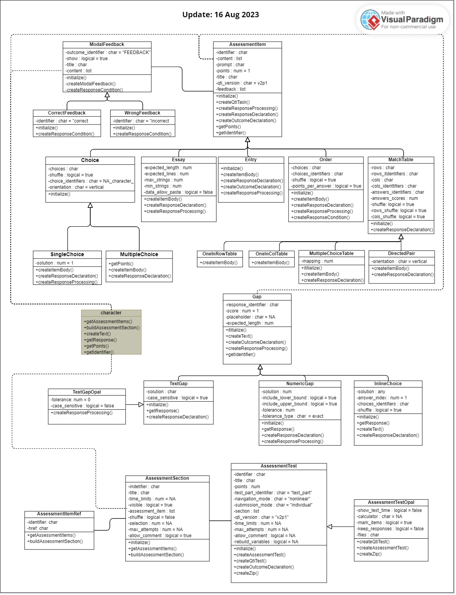

<!-- README.md is generated from README.Rmd. Please edit that file -->

```{r, include = FALSE}
knitr::opts_chunk$set(
  collapse = TRUE,
  comment = "#>",
  fig.path = "man/figures/README-",
  out.width = "100%"
)
```

<!-- badges: start -->
<!-- badges: end -->

# qti

Note: this is work in progress, at the moment you cannot actually use this package.

The goal of `qti` is to provide a clean and independent library for creating xml files according to the qti standard.

At the moment the exams package uses templates and pastes strings together to create qti files. This has some disadvantages: it is error prone, hard to maintain and extend. If for instance, a new exercise type needs to be added, many locations have to be changed. `qti` is supposed to make life easier by providing some standard functions to create all parts of the xml file. It uses xml2, so is more readable and less error prone.

An initial idea was to have something like htmltools for qti. (Maybe the qti-standard is too complex for that.)

Extending exams is just a matter of composing the correct `qti` functions. Testing small `qti` functions is easy, whereas the main function of `exams` `make_item_body` consists of 736 lines. Indeed, this function has grown substantially over time (todo: provide evidence).

Based on qti one can also develop new interfaces for creating exercises. Our companion package `rex` is based on `exams` but provides new inputs such as:

- multiple gaps and dropdowns in between text
- order exercises
- matching exercises

Specifically, adding multiple gaps or dropdowns in between text is rather difficult to do within the existing exams package.

## features of rex

should be moved to rex

- rendering of qti files in in the browser (or viewer pane)
- functions to upload files via REST API to LMS (for us OPAL, but you can implement your own)

## Installation

## Supported Exercise Types
| Types | Notes | S4 Class name |
|-------|-------|---------------|
|singlechoice|partially implemented|SingleChoice|
|multiplechoice|partially implemented|MultipleChoice|
|text entry|partially implemented|TextEntry|
|numbers entry|in progress|NumericEntry
|dropdown list|partially implemented|InlineChoice|
|order|partially implemented|Order|
|match (directed pair)|partially implemented|DirectedPair|
|match (table, one right answer in a row)|partially implemented|OneInRowTable|
|match (table, one right answer in a column)|partially implemented|OneInColTable|
|match (table, many right answers in columns and rows are possible)|partially implemented|MultipleChoiceTable|
|essay|partially implemented|Essay|



## What is not possible

- Composites are not implemented because they do not work in our LMS (OPAL); several gaps do work, though
- Associates are not implemented because they does not work in OPAL

## create rmd for

https://www.imsglobal.org/question/qtiv2p1/imsqti_implv2p1.html

be creative:  
clozes in between text, dropdowns in between text -> implement some yaml for input

## making gaps

for gaps with text:  
-  Simply use <code><<>></code> for a gap, example:  
*Some text, and now the gap <code>\<\<Right answer>\>></code>*  
-  or use YAML description inside <<>> to add more attributes:  
*Some Text, and then the gap: <code><<{type: text, response: Right answer, alternatives: [Right answer, right answer, answer], case_sensitive: false, lenghth: 10, placeholder: some text>></code> Some more text.*  

#### List of attributes for YAML description of a gap  with text content

|attribute|type|description|
|-|-|-|
|type|text|"type" attribute should assign "text" for gap with text content|
|response|text|string value that is a right response for the gap|
|alternatives|vector of string values|provides a set of alternative values that are considered as a right answer for the gap; the set of alternatives must not include the value of the correct answer|
|case_sensitive|logical|controls whether or not the candidate answer is case sensitive. In case of omission, "true" is assigned|
|length|integer|sets the size of the text field|
|placeholder|string|provides placeholder text in the text field, can be used to show some pattern of answer|
|score|integer|mark for the correct answer to the question|


for gaps with numbers:

#### List of attributes for YAML description of a gap  with numeric content

|attribute|type|description|
|-|-|-|
|type|text|"type" attribute should assign "numeric" for gap with numeric content|
|response|numeric|numeric value that is a right response for the gap|
|value_precision|numeric|number to indicate the upper and lower bounds within which the candidate's answer is considered correct|
|type_precision|string|can be \"exact\", \"absolute\", or \"relative\" only|
|lower_bound|logical|controls whether or not the lower bound is included in tolerance range. In case of omission, "true" is assigned|
|upper_bound|logical|controls whether or not the upper bound is included in tolerance range. In case of omission, "true" is assigned|
|length|integer|sets the size of the text field|
|placeholder|string|provides placeholder text in the text field, can be used to show some pattern of answer|
|score|integer|mark for the correct answer to the question|

for combination:  

## making dropdowns

