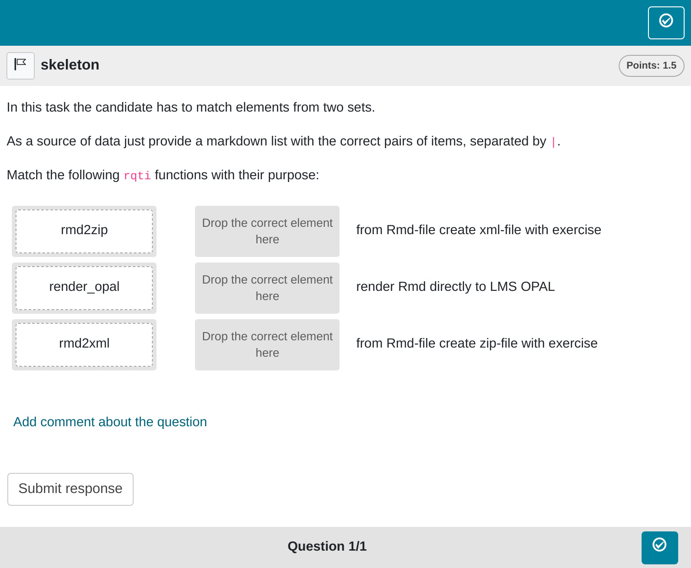

# Directed Pair tasks

## Minimum version

In this type of task, the student is given two sets of items, which need
to be matched. A template is automatically created when you initiate an
rqti project through RStudio. Alternatively, it can be added by clicking
on `New file -> R Markdown -> From Template`. The `rqti` templates end
with [rqti](https://github.com/shevandrin/rqti). Here we look at the
templates `directedpair (simple)` and `directedpair (complex)`.

The minimum you need to provide is the `type: pair` (or the equivalent
`type: dp`) in the yaml-section and a list with at least two elements in
a section called **\#question**:

    ---
    type: pair
    knit: rqti::render_qtijs
    ---

    # question

    In this task the candidate has to match elements from two sets.

    As a source of data just provide a markdown list with the correct pairs of
    items, separated by `|`.

    Match the following `rqti` functions with their purpose:

    * rmd2zip | from Rmd-file create zip-file with exercise
    * rmd2xml | from Rmd-file create xml-file with exercise
    * render_opal | render Rmd directly to LMS OPAL

    # feedback

    Provide your feedback here.

Knitting via the Knit-Button to qtijs, this task renders as:

Directed pair task rendered with qtijs

The pairs are specified by a markdown list in which the matching
elements are separated by `|`. This list has to be the last element of
the question section!

An alternative is to provide a table task with the matching elements,
see the article
[Tables](https://shevandrin.github.io/rqti/articles/table.md).

Note that in the used example, a feedback section was also provided. The
feedback is optional, but usually it is a good idea to give some
explanation for students.

Note that the `knit` parameter is set to the custom rqti knit function,
which will handle the preview. Clicking the Knit button in RStudio
renders the file in the viewer pane. Alternatively, change the knit
parameter to `knit: rqti::render_opal` (see article [Working with the
OPAL API](https://shevandrin.github.io/rqti/articles/api_opal.md)) to
upload to opal directly, producing:

Directed pair task rendered in OPAL

## More control

If you want to have more fine-grained control, consider the RMD template
`directedpair (complex)`, wich uses more yaml attributes.

    ---
    type: dp
    knit: rqti::render_qtijs
    identifier: TOPIC1_Q006 # think twice about this id for later data analysis!
    title: A meaningful title that can be displayed in the LMS
    orientation: horizontal # how items are placed on screen
    shuffle: true # random order of elements
    ---

    # question

    In this task the candidate has to match elements from two sets.

    As a source of data just provide a markdown list with the correct pairs,
    separated by `|`.

    Match the following `rqti` functions with their purpose:

    * rmd2zip | from Rmd-file create zip-file with exercise
    * rmd2xml | from Rmd-file create xml-file with exercise
    * render_opal | render Rmd directly on LMS OPAL

    # feedback

    Provide your feedback here.

    <!-- If you prefer specific feedback for correct and incorrect solution, delete
    the general feedback section and uncomment everything starting from this line:

    # feedback+

    Nice. (Only displayed when the solution is correct.)

    # feedback-

    Try again. (Only displayed if the solution is not correct.)
    -->

In OPAL this renders as shown in the next image. The viewport is a bit
too small to capture the entire task.

More complex directed pair task rendered in OPAL

## yaml attributes

### type

Has to be `pair` or `dp`.

### identifier

This is the ID of the task, useful for later data analysis of results.
The default is the file name. If you are doing extensive data analysis
later on it makes sense to specify a meaningful identifier. In all other
cases, the file name should be fine.

### title

Title of the task. Can be displayed to students depending on the
learning management system settings. Default is the file name.

### orientation

Defines the `vertical` or `horizontal` mode of displaying responses.
Default is `vertical`.

### shuffle

If `true` (the default), randomizes the order of the elements. Only in
rare occasions it makes sense to have a strict order of elements
(setting shuffle to `false`).

### points

How many points are given for the whole task. Default is $0.5 \cdot n$,
where $n$ is the number of pairs.

### abbr_id

If `abbr_id` is not specified, `rqti` generates the identifiers
`right_1`, `right_2`, … `right_N` and `left_1`, `left_2`, … `left_N`.
However, these lack inherent semantics. To enhance clarity, some users
might want to use the `abbr_id` parameter, which introduces abbreviated
identifiers based on the text of the pairs. The utility of these
abbreviations varies based on item length, but they consistently offer
more meaningful identifiers compared to non-semantic alternatives.

## Feedback

Feedback can be provided with the section

- **\# feedback** (general feedback, displayed every time, without
  conditions)
- **\# feedback+** (only provided if student reaches all points)
- **\# feedback-** (only provided if student does not reach all points)

## Some advice on directed pair tasks

Directed pairs are forced choice tasks, so they have similar problems as
single choice and multiple choice tasks (guessing). A specific problem
of directed pairs is that answers are not independent. Making a mistake
will lead to additional mistakes because two elements are blocked by one
match. Use directed pairs with care.

One might think that directed pairs are superfluous because match tables
serve the same purpose. The difference is that in match tables either
the row or column can be used more than once. For directed pairs,
matching a pair makes both elements unavailable for further matching.
This is unique, so there are use cases for directed pairs. But it is
important to note that match tables can also represent a direct pair,
meaning both directed pairs and match tables can serve as interfaces to
the same concept. However, match tables are generally more flexible and
are often the preferred choice (refer to the article [Table
tasks](https://shevandrin.github.io/rqti/articles/table.md) for more
details).
