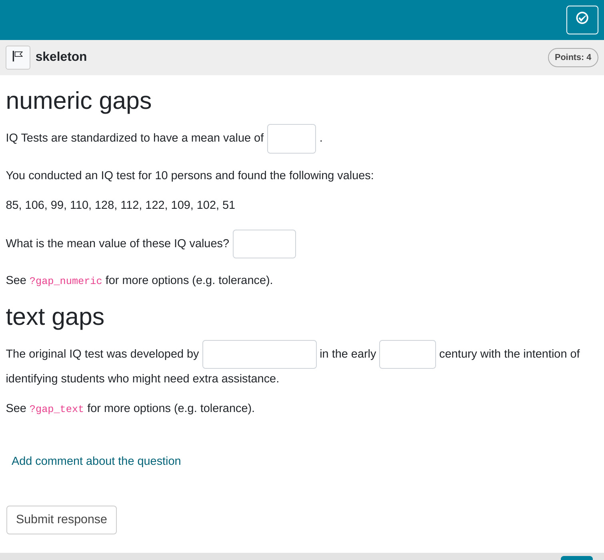

# Gap tasks

In this task format, candidates are required to fill in one or more
gaps. We believe this method is one of the most effective ways to assess
students’ abilities, as it reduces the likelihood of guessing compared
to multiple-choice questions. Emphasizing gap-fill tasks often leads to
more reliable assessment outcomes.

Our package allows for the integration of both textual and numeric
responses within a single task, offering instructors greater flexibility
in designing assessments.

## Minimum version

A minimum template is automatically created when you initiate an rqti
project through RStudio. Alternatively, it can be added by clicking on
`New file -> R Markdown -> From Template`. The `rqti` templates end with
[rqti](https://github.com/shevandrin/rqti). Here we look at the
templates `gap (simple)` and `gap (complex)`.

The minimum you need to provide is the `type: gap` (or the equivalent
`type: cloze`) in the yaml-section and some text, where at least one gap
is used, in a section called **\#question**. Furthermore, when employing
helper functions from the rqti package, it is essential to ensure its
prior loading.

    ---
    type: gap
    knit: rqti::render_qtijs
    ---

    ```{r, preparation}
    library(rqti)
    ```

    ```{r, data}
    iq <- round(rnorm(10, 100, 15))
    mean_iq <- mean(iq)
    ```

    # question

    ## numeric gaps

    IQ Tests are standardized to have a mean value of <<100>>.

    You conducted an IQ test for 10 persons and found the following values: 

    `r iq`

    What is the mean value of these IQ values? `r gap_numeric(mean(iq))`

    See `?gap_numeric` for more options (e.g. tolerance).

    ## text gaps

    The original IQ test was developed by `r gap_text(c("Alfred Binet", "Binet", "A. Binet"))` in the early <<20th>> century with the intention of identifying students who might need extra assistance.

    See `?gap_text` for more options (e.g. tolerance).

    # feedback

    1. IQ Tests are standardized to have a mean of 100.
    1. The correct mean value for `r iq` is `r mean_iq`.
    1. The original IQ test was developed by Alfred Binet.
    1. It was in the 20th century.

Clicking on the Knit-button will produce:


Simple gap task rendered in qtijs

Alternatively, change the knit parameter to `knit: rqti::render_opal`
(see article [Working with the OPAL
API](https://shevandrin.github.io/rqti/articles/api_opal.md)) to upload
to OPAL directly, producing:



Simple gap task rendered in OPAL

As you can see, there are two ways to create a gap in an Rmd file:

- Put the correct answer between `<<` … `>>` (or the equivalent `<gap>`
  … `</gap>`). Example: `<<3.14>>` or `<<sometext>>`
- use the helper functions
  [`?gap_numeric`](https://shevandrin.github.io/rqti/reference/gap_numeric.md)
  and
  [`?gap_text`](https://shevandrin.github.io/rqti/reference/gap_text.md)
  (also see details below, section [Helper function gap text](#gaptext),
  [Helper function gap numeric](#gapnumeric))

By default, 1 point can be reached for each gap (specify `points` in the
helper function to your needs). The total number of points for
completing a task is defined as the sum of points of all gaps.

Note that in this example, a feedback section was also provided. The
feedback is optional, but usually it is a good idea to give some
explanation for students. In gap tasks the feedback refers to the whole
task, not to a specific gap. Group your feedback into appropriate
sections, which can be opened/closed for better user experience (use
`<details>` and `<summary>` html tags).

A great way to do this is to use `<details>` and `<summary>` html tags:

``` html
<details><summary>Question1</summary>
  Provide Feedback for Question 1
</details>
<details><summary>Question 2</summary>
  Provide Feedback for Question 2
</details>
```

will render as:

Question 1

Provide Feedback for Question 1

Question 2

Provide Feedback for Question 2

## More control

If you want to have more fine-grained control, consider the RMD template
`gap (complex)`, which uses more yaml attributes and more complex calls
of the helper functions.

    ---
    type: gap # type of exercise
    knit: rqti::render_qtijs # if you do not want our preview renderer, remove this
    identifier: gap001 # think twice about this id for later data analysis!
    title: A meaningful title that can be displayed in the LMS
    ---

    ```{r, preparation}
    library(rqti)
    ```

    ```{r, data}
    iq <- round(rnorm(10, 100, 15))
    mean_iq <- mean(iq)
    ```

    # question

    ## numeric gaps

    IQ Tests are standardized to have a mean value of <<100>>.

    You conducted an IQ test for 10 persons and found the following values: 

    `r iq`

    What is the mean value of these IQ values? `r gap_numeric(mean(iq))`

    The same question, but now with a tolerance of +-5: `r gap_numeric(mean(iq), tolerance = 5)`

    The parameter `tolerance_type` determines how the tolerance is calculated.

    The same question, but now with a relative tolerance of +-5%: `r gap_numeric(mean(iq), tolerance = 5, tolerance_type = "relative")`

    ## text gaps

    The original IQ test was developed by `r gap_text(c("Alfred Binet", "Binet", "A. Binet"))` in the early 20th century with the intention of identifying students who might need extra assistance. Over the years, IQ tests have evolved, and various versions exist today, such as the WAIS, standing for `r gap_text("Wechsler", case_sensitive = F, tolerance = 2)` Adult Intelligence Scale, and the <<Stanford>>-Binet Intelligence Scales.

    Please be advised that OPAL has introduced a new attribute for text gaps—`tolerance`—which now accommodates considerations for spelling errors. It is crucial to restrict the use of this attribute to the OPAL Learning Management System (LMS), as it may not be compatible with other Learning Management Systems. Furthermore, it is important to note that employing this attribute will result in the XML files being rendered invalid according to the QTI standard.

    # feedback

    1. IQ Tests are standardized to have a mean of 100.
    1. The correct mean value for `r iq` is `r mean_iq`.
    1. The original IQ test was developed by Alfred Binet.
    1. WAIS: W stands for Wechsler
    1. It is the Stanford-Binet Intelligence Scales.

    <!-- If you prefer specific feedback for correct and incorrect solution, delete
    the general feedback section and uncomment everything starting from the next
    line:

    # feedback+

    Nice. (Only displayed when the solution is correct.)

    # feedback-

    Try again. (Only displayed if the solution is not correct.)
    -->

In OPAL this renders as :


Preview of complex gap task in OPAL

## yaml attributes

### type

Has to be `gap` or `cloze`.

### identifier

This is the ID of the task, useful for later data analysis of results.
The default is the file name. If you are doing extensive data analysis
later on it makes sense to specify a meaningful identifier. In all other
cases, the file name should be fine.

### title

Title of the task. Can be displayed to students depending on the
learning management system settings. Default is the file name.

## Feedback

Feedback can be provided with the section

- **\# feedback** (general feedback, displayed every time, without
  conditions)
- **\# feedback+** (only provided if student reaches all points)
- **\# feedback-** (only provided if student does not reach all points)

## Helper function `gap_numeric`

This helper function is designed to generate a formatted string
describing a gap in Rmd content, where the answer has a numeric type:

``` r
gap1 <- gap_numeric(solution = 1.4, tolerance = 10, tolerance_type = "relative",
                    points = 5, response_identifier = "mean_value",
                    include_lower_bound = TRUE, include_upper_bound = TRUE,
                    expected_length = 10, placeholder = "put mean value here")
cat(gap1)
<gap>{solution: [1.4], tolerance: 10.0, tolerance_type: relative, points: 5.0, response_identifier: mean_value, include_lower_bound: yes, include_upper_bound: yes, expected_length: 10.0, placeholder: put mean value here, type: numeric}</gap>
```

As you can see, YAML is ultimately used, but for most users, it is more
convenient to have a dedicated R function instead. Let us now look at
the argument list of `gap_numeric`:

### solution

Correct numeric answer.

### tolerance

Defines the range of values within which an answer is deemed correct.

### tolerance_type

Defines how the tolerance is calculated. For instance, if the solution
is 50 and the tolerance is 10:

- Setting `tolerance_type` to `relative` results in a correct answer
  range from 45 to 55 (50 ± 10%).
- Setting it to `absolute` creates a range from 40 to 60 (50 ± 10).

### points

The number of points for this gap. Default is 1.

### response_identifier

This is the ID of the gap, useful for later data analysis. The default
has the format “response_1”, “response_2”. If you are doing extensive
data analysis later on, it makes sense to specify a meaningful
identifier.

### include_lower_bound

Specifies whether the lower bound is included in the tolerance interval.

### inclue_upper_bound

Specifies whether the upper bound is included in the tolerance interval.

### expected_length

Specifies the size of the text input field in the content delivery
engine. This value is not directly assigned, it is calculated based on
the number of symbols in the solution value. Browsers display the input
field length inconsistently, but we have endeavored to establish
sensible defaults.

### placeholder

Text displayed in the gap, before an answer is attempted. Can be used
for hints (e.g. *numbers only*).

## Helper function `gap_text`

This helper function is designed to generate a formatted string
describing a gap in Rmd content, where the answer is a string:

``` r
gap2 <- gap_text(gap_text(c("Bildungsportal Sachsen", "Bildungs Portal Sachsen"),
                          tolerance = 4, case_sensitive = FALSE, 
                          placeholder = "text without special characters",
                          expected_length = 25))
cat(gap2)
<gap>{solution: [<gap>{solution: [Bildungsportal Sachsen,Bildungs Portal Sachsen], tolerance:,   4.0, case_sensitive: no, points: 1.0, expected_length: 25.0, placeholder: text without,   special characters, type: text_opal}</gap>], case_sensitive: no, points: 1.0, expected_length: 205.0, type: text}</gap>
```

Argument list of `gap_text`:

### solution

Determines a string vector of values that are considered as correct
answers.

### tolerance (works only in LMS OPAL)

Defines how many characters will be taken into account to tolerate
spelling mistakes. The exact algorithm of OPAL is unclear.

### case_sensitive (works only in LMS OPAL)

Determines whether the evaluation of the correct answer is case
sensitive. Default is `FALSE`.

### points

The number of points for this gap. Default is 1.

### response_identifier

This is the ID of the gap, useful for later data analysis. The default
has the format “response_1”, “response_2”. If you are doing extensive
data analysis later on, it makes sense to specify a meaningful
identifier.

### expected_length

Specifies the size of the text input field in the content delivery
engine. The default value is calculated based on the number of symbols
in the solution value. Browsers display the input field length
inconsistently, but we have endeavored to establish sensible defaults.
Please adjust to your needs.

### placeholder

Text displayed in the gap, before an answer is attempted. Can be used
for hints (e.g. *numbers only*).

## Some advice on gap tasks

Gap tasks are generally foolproof, offering an ideal format by
minimizing guessing and often presenting a reasonably high level of
difficulty. Numeric tasks, involving calculations that are typically not
guessable, are especially effective. While crafting text gaps may be
more intricate, the option to offer multiple alternative solutions and
leverage OPAL to accommodate spelling errors enhances their versatility.
Nevertheless, it is important to note that, like any task, gap tasks can
be poorly designed, so be mindful in their creation.

As mentioned earlier, numeric and text gaps can be combined in a single
task, making them quite versatile. In fact, the flexibility of gaps
allows for the integration of various task types within a single task.
For instance, to incorporate single-choice questions alongside gaps, you
can use a numeric gap for the single-choice question and include the
answer options directly in the question. For example, “Fill in the
blank: \_\_\_\_ (0 = not significant, 1 = significant)”. This approach
enables you to use gaps for many types of questions, highlighting their
exceptional adaptability.
