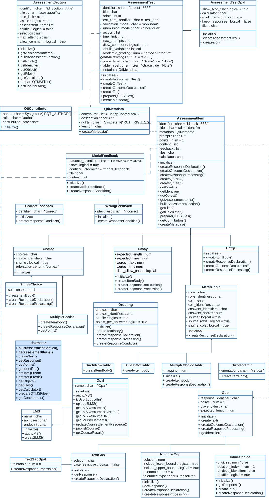

# rqti OOP Model

The Rmd interface of `rqti` is excellent for quickly getting started,
but it has some drawbacks. First, it can be quite slow, as the Rmd file
must be converted to HTML before it can be used. This delay is
especially noticeable when generating several versions of multiple
tasks. Additionally, Rmd lacks flexibility in handling task parameters.
For instance, while it is possible to select specific questions within a
task by passing parameters during knitting, this approach is not very
convenient.

Another challenge with Rmd is storing and distributing the files, as
there is no standard method for doing so. While you can host the files
somewhere, there is no easy way for instructors to know when a new
version is available. Ultimately, while Rmd is great for readability, it
is not designed for rigorous programming. If you want to fully leverage
a programming language when creating exercises and exams, a programming
interface is a better choice.

The `rqti` package offers such an interface, as it uses S4
object-oriented programming (OOP) under the hood. This allows you to
create all task types as objects, providing greater flexibility and
faster performance. You can also share your tasks by creating an R
package. If you are content with Rmd, there is nothing wrong with
continuing to use it. However, if you are looking to take your work to
the next level, consider creating task objects directly.

First, check out the overview of our classes:



The `rqti` class model consists of classes that represent types of
tasks:

- [`?SingleChoice`](https://shevandrin.github.io/rqti/reference/SingleChoice-class.md)
- [`?MultipleChoice`](https://shevandrin.github.io/rqti/reference/MultipleChoice-class.md)
- [`?Essay`](https://shevandrin.github.io/rqti/reference/Essay-class.md)
- [`?Entry`](https://shevandrin.github.io/rqti/reference/Entry-class.md)
- [`?Ordering`](https://shevandrin.github.io/rqti/reference/Ordering-class.md)
- [`?DirectedPair`](https://shevandrin.github.io/rqti/reference/DirectedPair-class.md)
- [`?MultipleChoiceTable`](https://shevandrin.github.io/rqti/reference/MultipleChoiceTable-class.md)
- [`?OneInRowTable`](https://shevandrin.github.io/rqti/reference/OneInRowTable-class.md)
- [`?OneInColTable`](https://shevandrin.github.io/rqti/reference/OneInColTable-class.md)

In addition there are classes for the interaction elements of tasks:

- [`?TextGap`](https://shevandrin.github.io/rqti/reference/TextGap-class.md)
- [`?NumericGap`](https://shevandrin.github.io/rqti/reference/NumericGap-class.md)
- [`?InlineChoice`](https://shevandrin.github.io/rqti/reference/InlineChoice-class.md)
- [`?TextGapOpal`](https://shevandrin.github.io/rqti/reference/TextGapOpal-class.md)
- [`?ModalFeedback`](https://shevandrin.github.io/rqti/reference/ModalFeedback-class.md)
- [`?CorrectFeedback`](https://shevandrin.github.io/rqti/reference/CorrectFeedback-class.md)
- [`?WrongFeedback`](https://shevandrin.github.io/rqti/reference/WrongFeedback-class.md)

Finally, there are classes for tests and their sections:

- [`?AssessmentSection`](https://shevandrin.github.io/rqti/reference/AssessmentSection-class.md)
- [`?AssessmentTest`](https://shevandrin.github.io/rqti/reference/AssessmentTest-class.md)
- [`?AssessmentTestOpal`](https://shevandrin.github.io/rqti/reference/AssessmentTestOpal-class.md)

## Creating objects

There are two ways to create objects:

1.  A call to `new` with the corresponding class and parameters.
2.  Using constructor functions (recommended).

Constructor functions share the same names as their corresponding
classes, with the first letter in lowercase. These constructors are
again categorized into tasks, interactions, and sections/tests.

The following functions create classes representing different types of
tasks:

- [`?singleChoice`](https://shevandrin.github.io/rqti/reference/singleChoice.md)
- [`?multipleChoice`](https://shevandrin.github.io/rqti/reference/multipleChoice.md)
- [`?essay`](https://shevandrin.github.io/rqti/reference/essay.md)
- [`?entry`](https://shevandrin.github.io/rqti/reference/entry.md)
- [`?ordering`](https://shevandrin.github.io/rqti/reference/ordering.md)
- [`?directedPair`](https://shevandrin.github.io/rqti/reference/directedPair.md)
- [`?multipleChoiceTable`](https://shevandrin.github.io/rqti/reference/multipleChoiceTable.md)
- [`?OneInRowTable`](https://shevandrin.github.io/rqti/reference/OneInRowTable-class.md)
- [`?oneInColTable`](https://shevandrin.github.io/rqti/reference/oneInColTable.md)

The following functions create classes representing interactions within
tasks:

- [`?textGap`](https://shevandrin.github.io/rqti/reference/textGap_doc.md)
- [`?numericGap`](https://shevandrin.github.io/rqti/reference/numericGap_doc.md)
- [`?textGapOpal`](https://shevandrin.github.io/rqti/reference/textGapOpal_doc.md)
- [`?modalFeedback`](https://shevandrin.github.io/rqti/reference/modalFeedback.md)
- [`?correctFeedback`](https://shevandrin.github.io/rqti/reference/correctFeedback.md)
- [`?wrongFeedback`](https://shevandrin.github.io/rqti/reference/wrongFeedback.md)

The following functions create classes representing tests and their
sections:

- [`?assessmentSection`](https://shevandrin.github.io/rqti/reference/assessmentSection.md)
- [`?assessmentTest`](https://shevandrin.github.io/rqti/reference/assessmentTest.md)
- [`?assessmentTestOpal`](https://shevandrin.github.io/rqti/reference/assessmentTestOpal.md)

## Creating tasks

First, it is important to know that you can create an object directly
from Rmd files:

``` r
scpath <- fs::path_package("rmarkdown/templates/singlechoice-simple/skeleton", 
                           "skeleton.Rmd", package = "rqti")
sc <- rqti:::create_question_object(scpath)
sc
#> An object of class "SingleChoice"
#> Slot "solution":
#> [1] 1
#> 
#> Slot "choices":
#> [1] "There is a 5% probability that you will mistakenly reject the null hypothesis, when it is actually correct. "
#> [2] "There is a 5% probability that the null hypothesis is correct."                                              
#> [3] "There is a 5% probability that you will mistakenly reject the alternative hypothesis, when it is correct."   
#> [4] "The test power is 95%."                                                                                      
#> 
#> Slot "choice_identifiers":
#> [1] "ChoiceA" "ChoiceB" "ChoiceC" "ChoiceD"
#> 
#> Slot "shuffle":
#> [1] TRUE
#> 
#> Slot "orientation":
#> [1] "vertical"
#> 
#> Slot "identifier":
#> [1] "skeleton"
#> 
#> Slot "title":
#> [1] "skeleton"
#> 
#> Slot "content":
#> [[1]]
#> [1] "<p>An alpha error of 5% means that:</p>"
#> 
#> 
#> Slot "prompt":
#> [1] ""
#> 
#> Slot "points":
#> [1] 1
#> 
#> Slot "feedback":
#> [[1]]
#> An object of class "ModalFeedback"
#> Slot "outcome_identifier":
#> [1] "FEEDBACKMODAL"
#> 
#> Slot "show":
#> [1] TRUE
#> 
#> Slot "identifier":
#> [1] "modal_feedback"
#> 
#> Slot "title":
#> character(0)
#> 
#> Slot "content":
#> [[1]]
#> [1] "<p>The correct interpretation is:</p>"
#> 
#> [[2]]
#> [1] "<p>There is a 5% probability that you will mistakenly reject the null hypothesis, when it is correct.</p>"
#> 
#> [[3]]
#> [1] "<p>This is based on the typical understanding of a 5% significance level in hypothesis testing, which means that you are willing to accept a 5% chance of making a Type I error.</p>"
#> 
#> 
#> 
#> 
#> Slot "files":
#> character(0)
#> 
#> Slot "calculator":
#> character(0)
#> 
#> Slot "metadata":
#> An object of class "QtiMetadata"
#> Slot "contributor":
#> [[1]]
#> An object of class "QtiContributor"
#> Slot "name":
#> [1] ""
#> 
#> Slot "role":
#> [1] "author"
#> 
#> Slot "contribution_date":
#> Date of length 0
#> 
#> 
#> 
#> Slot "description":
#> [1] ""
#> 
#> Slot "rights":
#> [1] ""
#> 
#> Slot "version":
#> character(0)
```

The structure of the object feels somewhat intimidating but is mostly
self-explanatory. For instance it has a slot named `solution` and
another one named `choices`. Other slots contain additional objects such
as a feedback or metadata object.

Now you can render this object with `render_qtijs`:

``` r
render_qtijs(sc)
```

You will notice that this approach is much faster than knitting, as it
eliminates intermediate steps. The XML file is generated directly from
the object representation and then copied to the qtijs server. No need
for Pandoc or any other translation tools.

But how would you create this object from scratch? This is not very
hard:

``` r
choices <- c(
  "There is a 5% probability that you will mistakenly reject the null
 hypothesis, when it is actually correct.",
  "There is a 5% probability that the null hypothesis is correct.",
  "There is a 5% probability that you will mistakenly reject the alternative
 hypothesis, when it is correct.",
  "The test power is 95%."
)

sc2 <- singleChoice(choices = choices, 
                    content = list("An alpha error of 5% means that:"))
```

Note that the content parameter is a list because it can also contain
non-strings. If you just put the text string, rqti will give you an
error. In the future we will simplify this case.

Again, you can render the object:

``` r
render_qtijs(sc2)
```

It looks the same because it is almost the same:

``` r
all.equal(sc, sc2)
#> [1] "Attributes: < Component \"calculator\": Lengths (0, 1) differ (string compare on first 0) >"
#> [2] "Attributes: < Component \"choices\": 2 string mismatches >"                                 
#> [3] "Attributes: < Component \"content\": Component 1: 1 string mismatch >"                      
#> [4] "Attributes: < Component \"feedback\": Length mismatch: comparison on first 0 components >"  
#> [5] "Attributes: < Component \"files\": Lengths (0, 1) differ (string compare on first 0) >"     
#> [6] "Attributes: < Component \"identifier\": 1 string mismatch >"                                
#> [7] "Attributes: < Component \"title\": 1 string mismatch >"
```

There are some differences in defaults, and we did not provide feedback
in this case, but overall, creating objects from scratch is relatively
straightforward. However, it becomes more challenging when incorporating
HTML, math, and images. These elements are seamlessly handled by the
Rmd-interface, but doing it from scratch requires more effort.

## Using html

Let us add a feedback object, including some html formatting created
with htmltools:

``` r
library(htmltools)

text1 <- p(
  "The correct interpretation is: ", 
  strong("There is a 5% probability that you will mistakenly reject the null 
 hypothesis, when it is correct.")
)

text2 <- tags$details(
  tags$summary("More Information"),
  "This is based on the typical understanding of a 5% significance level in
 hypothesis testing, which means that you are willing to accept a 5% chance of 
 making a Type I error."
)

fb <- modalFeedback(content = list(as.character(text1), as.character(text2)))

sc2b <- singleChoice(choices = choices, 
                     content = list("An alpha error of 5% means that:"),
                     feedback = list(fb))
```

Let us render the new task and activate the feedback in qtijs (you might
still need to reload the Viewer pane):

``` r
render_qtijs(sc2b, preview_feedback = T)
```

A couple of things should be noticed:

- we create the html tags with `htmltools`, but you can also use raw
  html tags (e.g. `<strong>my text</strong>`)
- details and summary tags are not available by default in htmltools, so
  must be created with `tags$`
- the feedback must be created with the constructors, in this case
  `modalFeedback`, which simply means that this feedback is displayed
  independently of the number of points reached
- the `feedback` parameter `content` can only take lists
- the `singleChoice` parameter `feedback` can only take lists

What if we want to add some math?

## Using maths

There are several ways to add formulas to your content, but the simplest
is to use latex syntax in html as per MathJax:

``` r
math <- r"(When \(a \ne 0\), there are two solutions to \(ax^2 + bx + c = 0\)
 and they are $$x = {-b \pm \sqrt{b^2-4ac} \over 2a}.$$)"
```

Note the use of `\(` and `\)` for inline math and `$$` for displayed
math. You cannot use `$` for inline math as per MathJax syntax.

Further note the `r"(...)"`-syntax, which escapes special characters
automatically.

Let us render it, this time within an essay task:

``` r
render_qtijs(
  essay(
    content = list(
      math, 
      as.character(p("Provide a proof for this solution."))
    )
  )
)
```

Adding math is straightforward, but what about graphics?

## Using graphics

There are various ways to incorporate them. A simple method is to save a
plot or image as raw bytes and embed it directly in a html image tag.

Let us first create a graph and save it in a temporary file:

``` r
imgfile <- tempfile(fileext = ".png")
png(imgfile, width = 800, height = 600, type = "cairo", pointsize = 16)
x <- seq(-2, 2, 0.1)
plot(x, dnorm(x))
dev.off()
#> agg_png 
#>       2
```

Now we can convert this to a raw byte string and put it inside image
tags using htmltools:

``` r
txt <- RCurl::base64Encode(readBin(imgfile, "raw",
                                   file.info(imgfile)[1, "size"]),
                           "txt")
image <- as.character(img(width = "400", 
                          src = paste0("data:image/png;base64,", txt)))
```

Finally, let us add it to a simple gap task:

``` r
gap_with_img <- entry(
  content = list(
    as.character(p("Here is an illustration of the standard normal distribution:")), 
    image, 
    "<p>What proportion of values is between -1 and +1 SD of a normal distribution?",
    gapNumeric(round(1 - 2 * pnorm(-1), 2), tolerance = 1, 
               tolerance_type = "relative"),
    "Round to two decimal points!",
    "</p>"
  )
)
```

and render it:

``` r
render_qtijs(gap_with_img)
```

A few things to keep in mind during this process:

- Ensure your image is well-prepared with the right aspect ratio,
  resolution, etc.
- You can use ggplot2 or other graphics libraries similarly.
- Consider creating a helper function to decode the image into raw
  bytes.
- For gap tasks, the gap must be placed within the content parameter,
  which makes using htmltools challenging. Currently, you need to use
  raw HTML tags to surround the gaps.
- Although the process is more complex than with Rmd, it gives you
  greater control over both the image creation and its display in HTML.
- Future improvements will simplify the process with constructors. For
  now, we need more experience and user feedback.

We covered most aspects of creating tasks with constructor functions.
Let us now look at creating sections and tests:

## Creating sections and tests

Let us combine the tasks from above into a section:

``` r
section1 <- assessmentSection(list(sc, gap_with_img))
```

And render it:

``` r
render_qtijs(section1)
```

There is not much to see here because we only have one section and qtijs
does not reveal the underlying structure. To illustrate better, let us
add another section and make a test:

``` r
items <- list(essay(content = list("Who was Ada Lovelace?")), 
              essay(content = list("Who was Grace Hopper?")))
section2 <- assessmentSection(items, selection = 1)
exam <- assessmentTest(list(section1, section2), time_limit = 10)
```

Render it:

``` r
render_qtijs(exam)
```

What is happening here? There are two sections, but only one item is
selected from section 2. Additionally, a time limit has been imposed for
the test.

The flexibility to arrange and select items within sections, and
organize sections within tests, provides significant control over the
assessment process. You can create parallel versions of items and easily
develop custom exam functions that generate different versions of tasks.

We have now covered the key constructor functions of the rqti package.
These functions empower you to build questions and exams from scratch,
giving you full control over the process. Moreover, this approach allows
you to package your questions and exams into standard R packages, making
distribution simple and efficient. While there is much more to explore,
you will need to dive deeper into the possibilities on your own.
