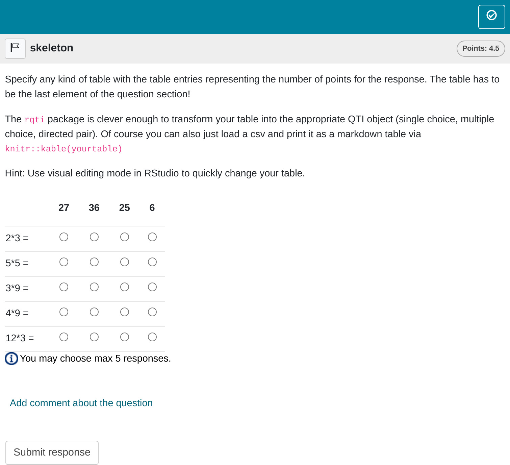

# Table tasks

In this type of task, the candidate matches rows with columns in a
table. This format is often used when multiple questions need to be
displayed concisely. Table tasks are highly versatile and are ideal for
creating both single-choice and multiple-choice questions.

## Minimum version

A minimum template is automatically created when you initiate an rqti
project through RStudio. Alternatively, it can be added by clicking on
`New file -> R Markdown -> From Template`. The `rqti` templates end with
[rqti](https://github.com/shevandrin/rqti). Here we look at the
templates `table (simple)` and `table (complex)`.

The minimum you need to provide is the `type: table` in the yaml-section
and a table in a section called **\#question**:

    ---
    type: table
    knit: rqti::render_qtijs
    ---

    # question

    Specify any kind of table with the table entries representing the number of
    points for the response. The table has to be the last element of the question
    section!

    The `rqti` package is clever enough to transform your table into the appropriate
    QTI object (single choice, multiple choice, directed pair). Of course you can
    also just load a csv and print it as a markdown table via
    `knitr::kable(yourtable)`

    Hint: Use visual editing mode in RStudio to quickly change your table.

    |      |27|36 |25| 6 |
    |------|--|---|--|---|
    |4*9 = |0 |0.5|0 | 0 |
    |3*9 = |1 |0  |0 | 0 |
    |5*5 = |0 |0  |1 | 0 |
    |2*3 = |0 |0  |0 | 1 |
    |12*3 =|0 |1  |0 | 0 |

    # feedback

    Provide your feedback here. For tables it is difficult to provide useful
    feedback because there are usually many questions. But most learning management
    systems will at least show which answers are correct and incorrect.

Clicking the Knit-Button will produce :

Preview of table task rendered by qtijs

Alternatively, change the knit parameter to `knit: rqti::render_opal`
(see article [Working with the OPAL
API](https://shevandrin.github.io/rqti/articles/api_opal.md)) to upload
to opal directly, producing :

Preview of table task rendered by OPAL

In the Rmd file, table entries indicate the points awarded for each
response. Any positive number is considered correct. You can also assign
negative numbers, which will reduce the total score, but the overall
score will never go below zero. You can specify the number of correct
responses per row and column as needed, which typically influences how
the table is presented. For example, there are special table
configurations where only one row is correct per column, and vice versa.
The `rqti` package handles these cases automatically, so no additional
steps are required on your part.

However, it is important to note that if your table represents a
directed pair, the `rqti` package will automatically convert it into a
directed pair task. If you prefer to keep it as a standard table, use
`as_table: true` in the YAML section of your Rmd file.

The overall points for the task are calculated as the sum of the
positive table entries.

Of course you can also just load a csv and print it as a markdown table
via `knitr::kable(yourtable)`. Just do not forget that the table has to
be the last element of the question section.

In this example, a feedback section was also included. While feedback is
optional, it is generally beneficial to provide some explanation to
students. However, offering detailed feedback can be challenging for
table tasks, especially when questions are presented in random order.
Most learning management systems at least indicate which answers are
correct or incorrect, so feedback can be more general, focusing on the
overall topic.

## More control

If you want to have more fine-grained control, consider the Rmd template
`table (complex)`, which uses more yaml attributes.

    ---
    type: table
    knit: rqti::render_qtijs
    identifier: TOPIC1_Q001 # think twice about this id for later data analysis!
    title: A meaningful title that can be displayed in the LMS
    shuffle_cols: false
    shuffle_rows: true
    abbr_id: true
    ---

    # question

    Specify any kind of table with the table entries representing the number of
    points for the response. The table has to be the last element of the question
    section!

    The `rqti` package is clever enough to transform your table into the appropriate
    QTI object (single choice or multiple choice). Of course you can also just load
    a csv and print it as a markdown table via `knitr::kable(yourtable)`

    Use visual editing mode in RStudio to quickly change your table.

    |      |27|36 |25| 6 |
    |------|--|---|--|---|
    |4*9 = |0 |0.5|0 | 0 |
    |3*9 = |1 |0  |0 | 0 |
    |5*5 = |0 |0  |1 | 0 |
    |2*3 = |0 |0  |0 | 1 |
    |12*3 =|0 |1  |0 | 0 |

    # feedback

    Provide your feedback here. For tables it is difficult to provide useful
    feedback because there are usually many questions. But most learning management
    systems will at least show which answers are correct and incorrect.

Which, in OPAL, renders as :

Preview of complex table task in the learning management system OPAL

You can see that the order of the columns is now the same as in the
source table.

## yaml attributes

### type

Has to be `table` or `match`.

### identifier

This is the ID of the task, useful for later data analysis of results.
The default is the file name. If you are doing extensive data analysis
later on it makes sense to specify a meaningful identifier. In all other
cases, the file name should be fine.

### title

Title of the task. Can be displayed to students depending on the
learning management system settings. Default is the file name.

### shuffle

If `true` (the default), randomizes the order of rows and columns. Only
in rare occasions it makes sense to have a strict order of elements
(setting shuffle to `false`). Overwrites `shuffle_rows` and
`shuffle_cols`.

### shuffle_rows

Only shuffle the rows. Default is `true`. Overwritten by `shuffle`.

### shuffle_cols

Only shuffle the columns. Default is `true`. Overwritten by `shuffle`.

### abbr_id

Defines the use of an abbreviation as a way to generate row and column
identifiers. Explained in more detail in the section [Managing
identifiers](#ids).

## Feedback

Feedback can be provided with the section

- **\# feedback** (general feedback, displayed every time, without
  conditions)
- **\# feedback+** (only provided if student reaches all points)
- **\# feedback-** (only provided if student does not reach all points)

## Managing identifiers

The identifiers for rows and columns are valuable for later data
analysis. If you plan to conduct extensive analysis, it is beneficial to
assign meaningful and easily recognizable identifiers.

Currently, there are two methods for creating row and column
identifiers:

1.  **Default Method**: By default, `rqti` generates identifiers in the
    format `row_1`, `row_2`, …, `row_N`, and `col_1`, `col_2`, …,
    `col_N`.
2.  **Abbreviation Method**: By setting `abbr_id: true` in the YAML
    section of your Rmd file, `rqti` generates identifiers by combining
    the first word of a row or column element with an abbreviation of
    the remaining text. For example, the element “Mean Value Theorem for
    Integrals” would be shortened to “Mean_VTfI”. If a row or column
    name starts with digits, `rqti` automatically adds a “row” or “col”
    prefix, as identifiers cannot begin with a number. Special
    characters are also removed.

After experimenting with various approaches, we settled on these
straightforward methods. If you require more control over the
identifiers, please open an issue on GitHub:
<https://github.com/shevandrin/rqti/issues>. We are open to
reconsidering the available options.

## Some advice on table tasks

Table tasks are forced choice tasks, so they suffer from the sample
problems as [single
choice](https://shevandrin.github.io/rqti/articles/singlechoice.md) and
[multiple
choice](https://shevandrin.github.io/rqti/articles/multiplechoice.md)
tasks. The advantage of table tasks is that they are easy so manage
(e.g. in csv-tables) and many questions can be asked at once, using
little space.
