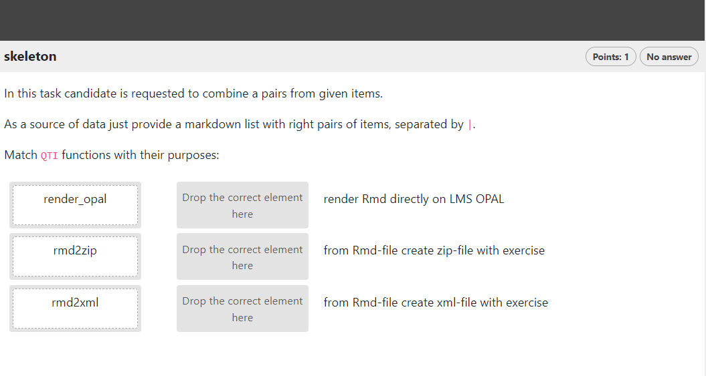
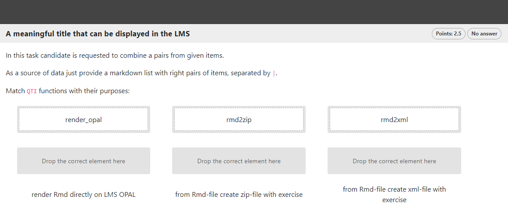

```{r, include = FALSE}
knitr::opts_chunk$set(
  collapse = TRUE,
  comment = "#>"
)
```

```{r setup, echo=FALSE}
library(qti)
```

## Minimum version

In this type of exercise, the candidate is given two sets of items and is required to match pairs from them. A template is available in RStudio when you click on `New file -> R Markdown -> From Template`. The qti templates start with `QTI:`. Here we look at the templates `QTI: directedpair (simple)` and `QTI: directedpair (complex)`.

The minimum you need to provide is the `type: pair` (or the equivalent `type: dp`) in the yaml-section and a list with at least two elements in a section called **\#question**:

```{r comment='', echo = F}
cat(readLines(fs::path_package("rmarkdown/templates/directedpair-simple/skeleton", "skeleton.Rmd", package = "qti")), sep = '\n')
```

In this task candidate is requested to combine a pairs from given items. As a source of data just provide a markdown list with pairs of items, separated by `|`. This list has to be the last element of the question section!

Note that in this example, a feedback section was also provided. The feedback is
optional, but usually it is a good idea to give some explanation for students.

Further note that the `knit` parameter is set to the custom qti knit function,
which will handle the preview. Clicking the Knit button in RStudio produces the
following in the viewer pane (or browser of your choice):

{width="400"}

## More control

If you want to have more fine-grained control, consider the RMD template `QTI: directedpair (complex)`, wich uses more yaml attributes.

```{r comment='', echo = F}
cat(readLines(fs::path_package("rmarkdown/templates/directedpair-complex/skeleton", "skeleton.Rmd", package = "qti")), sep = '\n')
```

Which renders as:

{width="400"}

# yaml attributes

### type

Has to be `pair` or `dp`.

### identifier

This is the id of the exercise, useful for later data analysis of results. The default is the file name. If you are doing extensive data analysis later on it makes sense to
specify a meaningful identifier. In all other cases, the file name should be
fine.

### title

Title of the exercise. Can be displayed to students depending on
the learning management system settings. Default is the file name.

### orientation

Defines the `vertical` or `horizontal` mode of displaying responses. Default is `vertical`.

### shuffle

It mixes the order of answer items. Default is `TRUE`.

###  points

How many points are given for the whole exercise. Default is 1. 

### answers_scores

In the case when it is important to have different values of points for different pairs, it is necessary to list these points in the same order that the pairs are defined in the list: `answers_scores: 2, 2, 1`. In this case, the total number of points will be calculated
as the sum of 'answers_scores', and the attribute 'points', if set, will be ignored.

### abbr_id

Defines the use of an abbreviation as a way to generate answer items identifiers. If `abbr_id` is omitted, then 'qti' generates identifiers as `right_1`...`right_N` and `left_1`...`left_N`

## Feedback

Feedback can be provided with the section

-   **\# feedback** (general feedback, displayed every time, without conditions)
-   **\# feedback+** (only provided if student reaches all points)
-   **\# feedback-** (only provided if student does not reach all points)

## Some advice on Directed Pair exercises 

TODO
