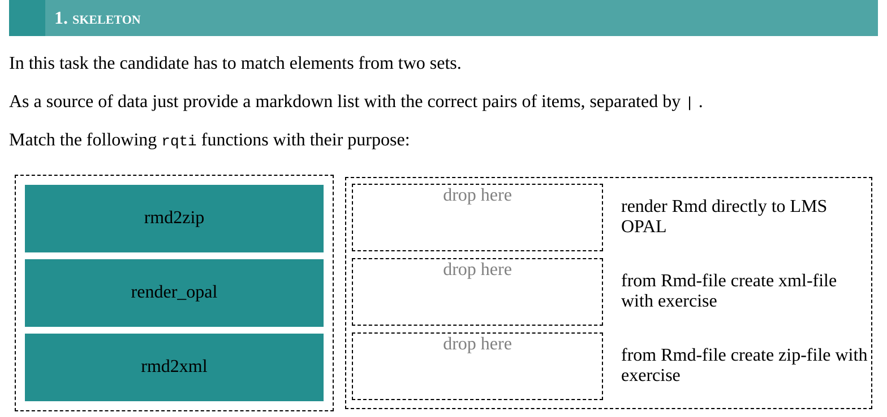
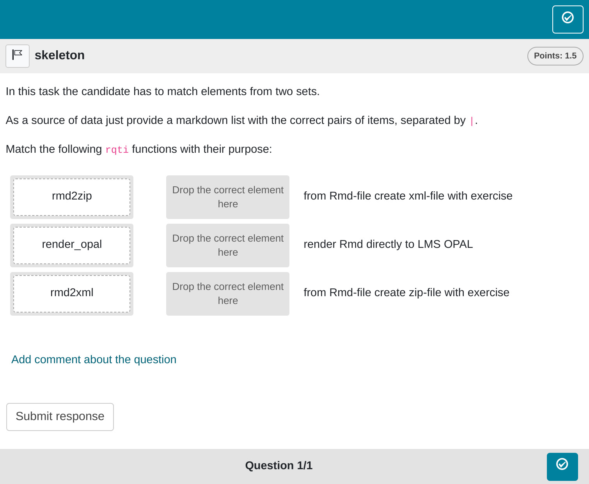
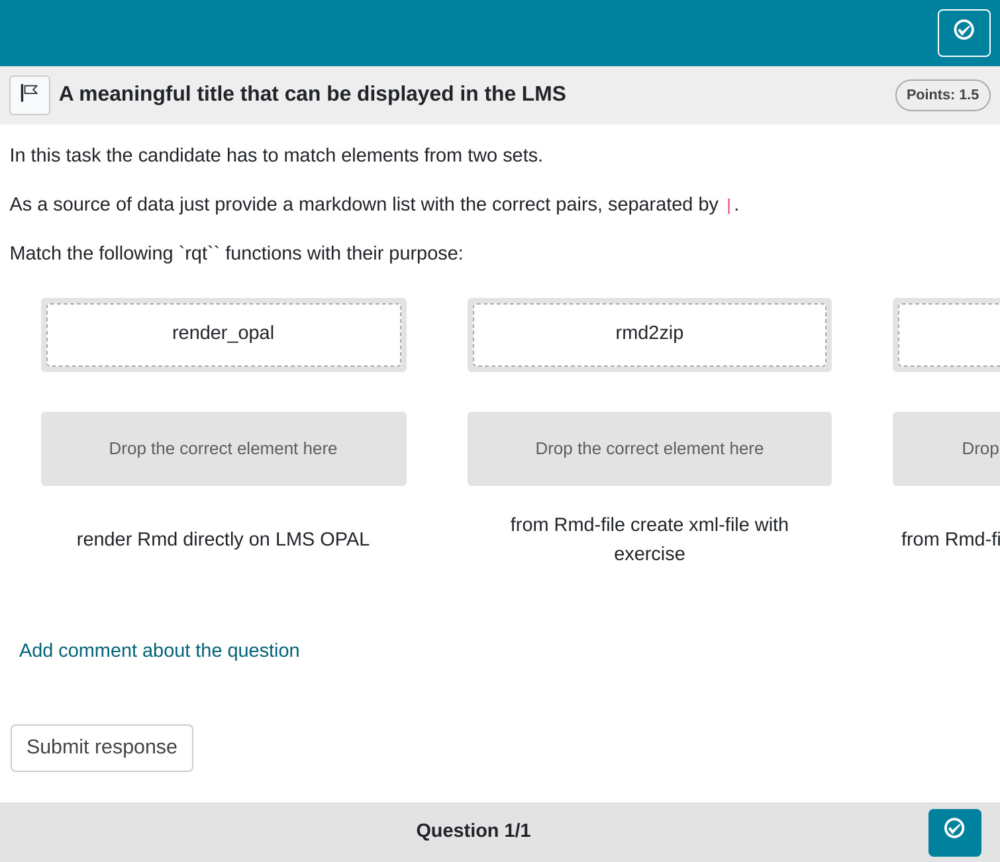

```{r, include = FALSE}
knitr::opts_chunk$set(
  collapse = TRUE,
  comment = "#>"
)
```

```{r setup, echo=FALSE}
library(rqti)
```

## Minimum version

In this type of exercise, the candidate is given two sets of items, which need to be matched. A template is automatically created when you initiate an rqti project through RStudio. Alternatively, it can be added by clicking on `New file -> R Markdown -> From Template`. The `rqti` templates start with `rqti`:`. Here we look at the templates `rqti: directedpair (simple)` and `qrti: directedpair (complex)`.

The minimum you need to provide is the `type: pair` (or the equivalent `type: dp`) in the yaml-section and a list with at least two elements in a section called **\#question**:

```{r comment='', echo = F}
path <- fs::path_package("rmarkdown/templates/directedpair-simple/skeleton", "skeleton.Rmd", package = "rqti")
cat(readLines(path), sep = '\n')
```

Knitting via the Knit-Button to qtijs, this exercise renders as:

{width=100%}

The pairs are specified by a markdown list in which the matching elements are separated by `|`. This list has to be the last element of the question section!

An alternative is to provide a table exercise with the matching elements, see [Tables](table.html).

Note that in the used example, a feedback section was also provided. The feedback is optional, but usually it is a good idea to give some explanation for students.

Note that the `knit` parameter is set to the custom rqti knit function,
which will handle the preview. Clicking the Knit button in RStudio renders the file in the viewer pane. Alternatively, change the knit parameter to `knit: rqti::render_opal` (see [API Opal](api_opal.html)) to upload to opal directly, producing:

{width=100%}

## More control

If you want to have more fine-grained control, consider the RMD template `rqti: directedpair (complex)`, wich uses more yaml attributes.

```{r comment='', echo = F}
cat(readLines(fs::path_package("rmarkdown/templates/directedpair-complex/skeleton", "skeleton.Rmd", package = "rqti")), sep = '\n')
```

In OPAL this renders as (the viewport is a bit too small to capture the entire exercise):

{width=100%}

## yaml attributes

### type

Has to be `pair` or `dp`.

### identifier

This is the ID of the exercise, useful for later data analysis of results. The default is the file name. If you are doing extensive data analysis later on it makes sense to
specify a meaningful identifier. In all other cases, the file name should be
fine.

### title

Title of the exercise. Can be displayed to students depending on
the learning management system settings. Default is the file name.

### orientation

Defines the `vertical` or `horizontal` mode of displaying responses. Default is `vertical`.

### shuffle

If `true` (the default), randomizes the order of the elements. Only in rare occasions it makes sense to have a strict order of elements (setting shuffle to `false`).

###  points

How many points are given for the whole exercise. Default is 1.

<!-- ### answers_scores -->

<!-- If it is important to have different values of points for different pairs, it is necessary to list these points in the same order that the pairs are defined in the list: `answers_scores: 2, 2, 1`. In this case, the total number of points will be calculated as the sum of 'answers_scores', and the attribute 'points', if set, will be ignored. -->

### abbr_id

If `abbr_id` is not specified, `rqti` generates the identifiers `right_1`, `right_2`, ... `right_N` and `left_1`, `left_2`, ... `left_N`. However, these lack inherent semantics. To enhance clarity, some users might want to use the `abbr_id` parameter, which introduces abbreviated identifiers. The utility of these abbreviations varies based on item length, but they consistently offer more meaningful identifiers compared to non-semantic alternatives.

## Feedback

Feedback can be provided with the section

-   **\# feedback** (general feedback, displayed every time, without conditions)
-   **\# feedback+** (only provided if student reaches all points)
-   **\# feedback-** (only provided if student does not reach all points)

## Some advice on directed pair exercises 

Directed pairs are forced choice exercises, so they have similar problems as single choice and multiple choice exercises (guessing increases variance). A specific problem of directed pairs is that answers are not independent. Making a mistake will lead to additional mistakes because two elements are blocked by one match. Use directed pairs with care.

One might think that directed pairs are superfluous because match tables serve the same purpose. The difference is that in match tables either the row or column can be used more than once. For directed pairs, matching a pair makes both elements unavailable for further matching. This is unique, so there are use cases for directed pairs. But it is important to note that match tables can also represent a direct pair, meaning both directed pairs and match tables can serve as interfaces to the same concept. However, match tables are generally more flexible and are often the preferred choice (refer to [Tables](table.html) for more details).
