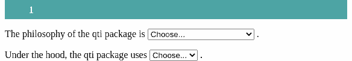
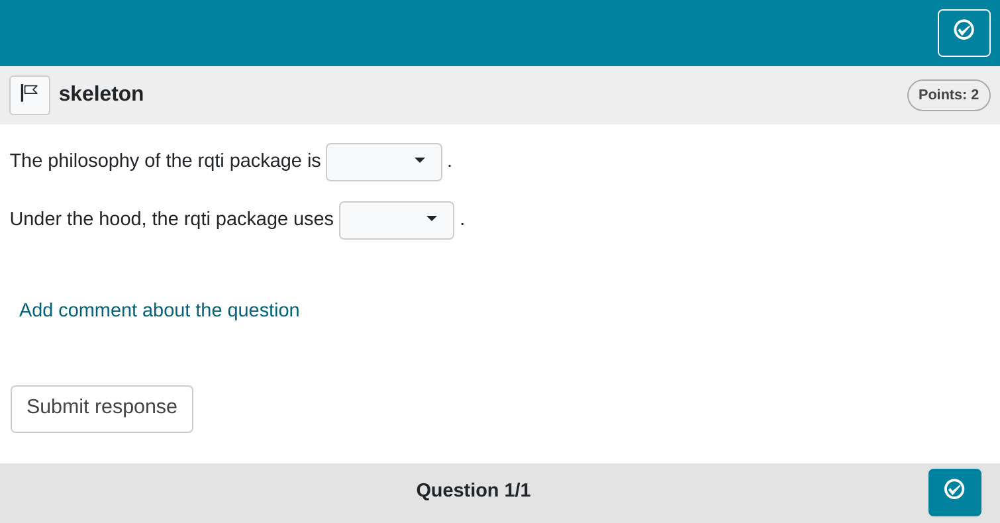
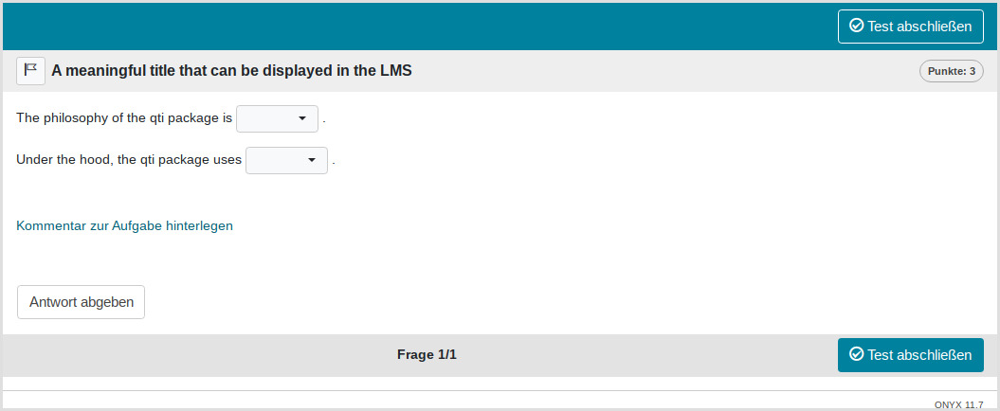

```{r, include = FALSE}
knitr::opts_chunk$set(
  collapse = TRUE,
  comment = "#>"
)
```

```{r setup, echo=FALSE}
library(qti)
```

## Minimum version

In this type of exercise, the candidate has to select an element form a dropdown-list. Note that our package implements dropdowns as gaps because this is essentialy what dropwdowns are. Several dropdowns can be combined in a single exercise, but a combination with numeric and text gaps is not possible. A template is available in RStudio when you click on `New file -> R Markdown -> From Template`. The qti templates start with `QTI:`. Here we look at the templates `QTI: dropdown (simple)` and `QTI: dropdown (complex)`.

The minimum you need to provide is the `type: dropdown` (or the equivalent `type: dd`) in the yaml-section and some text, where at least one gap is formed as a dropdown-element, in a section called  **\#question**:

```{r comment='', echo = F}
cat(readLines(fs::path_package("rmarkdown/templates/dropdown-simple/skeleton", "skeleton.Rmd", package = "qti")), sep = '\n')
```

Knitting via the Knit-Button to qtijs, this exercise renders as:



Alternatively, change the knit parameter to `knit: render_opal` (see [API Opal](opal_api)) to upload to Opal directly, producing:



There are 2 ways to specify a dropdown-element in Rmd content:

- Put the right answer inside `<<` ... `>>` (or the equivalent `<gap>` ... `</gap>`). Example: `<<element1|element2|element3>>`
- use the helper function [`dropdown`](#helper-function-dropdown)

By default, 1 point can be reached for each dropdown (specify `points` to your needs). The total number of points for completing a task is defined as the sum of points of all dropdowns.

Note that in this example, a feedback section was also provided. The feedback is
optional, but usually it is a good idea to give some explanation for students. In dropdown exercises the feedback refers to the whole task, not to a specific dropdown. Group your feedback into appropriate sections, which can be opened/closed for better user experience (use details and summary html tags).

## More control

If you want to have more fine-grained control, consider the RMD template `QTI: dropdown (complex)`, which uses more yaml attributes.

```{r comment='', echo = F}
cat(readLines(fs::path_package("rmarkdown/templates/dropdown-complex/skeleton", "skeleton.Rmd", package = "qti")), sep = '\n')
```

Which renders as:



## yaml attributes

### type

Has to be `dropdown` or `dd`.

### identifier

This is the id of the exercise, useful for later data analysis of results. The default is the file name. If you are doing extensive data analysis later on it makes sense to specify a meaningful identifier. In all other cases, the file name should be fine.

### title

Title of the exercise. Can be displayed to students depending on the learning management system settings. Default is the file name.

## Feedback

Feedback can be provided with the section

-   **\# feedback** (general feedback, displayed every time, without conditions)
-   **\# feedback+** (only provided if student reaches all points)
-   **\# feedback-** (only provided if student does not reach all points)

## Helper function `dropdown`

This helper function is used to generate a formatted string describing a dropdown in Rmd content:

```{r}
choices <- c("c1" = "S4 OOP", "c2" = "S3 OOP", "c3" = "no OOP", "c4" = "R6 OOP")
oop_task <- dropdown(choices = choices, solution = "S4 OOP",
                     response_identifier = "OOP_task")
oop_task
```

Argument list of `dropdown`:

### choices

Elements of dropdown. If you use a named vector, the names will be used as identifiers. This is useful for later data analysis.

### solution_index

The index of the correct choice as a numeric. Note that this is optional. Simply use the correct choice as the first element of `choices`, which is more concise.

### points

The number of points for the dropdown. Default is 1.

### shuffle

If `TRUE`, randomizes the order of the choices. Defaults to `TRUE`. Only in rare occasions it makes sense to have a strict order of choices (setting shuffle to `FALSE`).

### response_identifier

This is the ID of the dropdown-element, useful for later data analysis of results. The default has the format "response_1", "response_2", ..."response_n" for several dropdowns. If you are doing extensive data analysis later on, it makes sense to specify a more meaningful identifier.

## Some advice on dropdown exercises 

Dropdown exercises seem to be similar to numeric and text gaps, but they are forced choice items, so are actually equivalent to single choice exercises. The advantage is that they can be placed in between other text and several of them can be used in a single exercise. Still, they suffer from the same problems as [single choice exercises](singlechoice.html).
