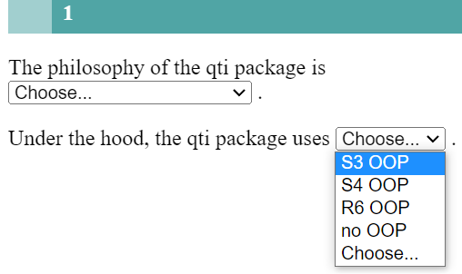
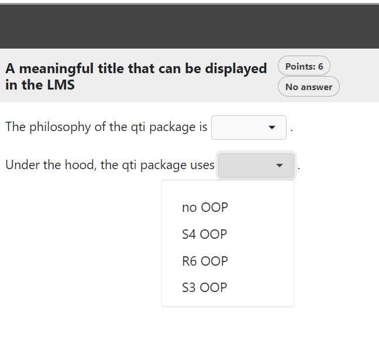

```{r, include = FALSE}
knitr::opts_chunk$set(
  collapse = TRUE,
  comment = "#>"
)
```

```{r setup, echo=FALSE}
library(qti)
```

## Minimum version

In this type of exercise, the candidate is asked to fill in the blanks from a set of options available from a dropdown list. A template is available in RStudio when you click on `New file -> R Markdown -> From Template`. The qti templates start with `QTI:`. Here we look at the templates `QTI: dropdown (simple)` and `QTI: dropdown (complex)`.

The minimum you need to provide is the `type: dropdown` (or the equivalent `type: dd`) in the yaml-section and some text, where at least one gap is formed as a dropdown-element, in a section called  **\#question**:

```{r comment='', echo = F}
cat(readLines(fs::path_package("rmarkdown/templates/dropdown-simple/skeleton", "skeleton.Rmd", package = "qti")), sep = '\n')
```

There are 2 ways to denote a dropdown-element in Rmd content:

- put inside `<<` ... `>>` (or the equivalent `<gap>` ... `</gap>`) set of answer options separating them by `|`. Example: `<<element 1|element 2|element 3>>`
- use the helper function `dropdown` (see more details below)

By default, each dropdown-elements gives 1 point for the correct answer. The total number of points for completing a task is defined as the sum of points for each dropdown-element.


Note that in this example, a feedback section was also provided. The feedback is
optional, but usually it is a good idea to give some explanation for students. In this type of exercise the feedback relates to the whole task, not to a specific gap.

Further note that the `knit` parameter is set to the custom qti knit function,
which will handle the preview. Clicking the Knit button in RStudio produces the
following in the viewer pane (or browser of your choice):

{width="400"}

## More control

If you want to have more fine-grained control, consider the RMD template `QTI: dropdown (complex)`, wich uses more yaml attributes.

```{r comment='', echo = F}
cat(readLines(fs::path_package("rmarkdown/templates/dropdown-complex/skeleton", "skeleton.Rmd", package = "qti")), sep = '\n')
```

Which renders as:

{width="400"}

# yaml attributes

### type

Has to be `dropdown` or `dd`.

### identifier

This is the id of the exercise, useful for later data analysis of results. The default is the file name. If you are doing extensive data analysis later on it makes sense to
specify a meaningful identifier. In all other cases, the file name should be
fine.

### title

Title of the exercise. Can be displayed to students depending on
the learning management system settings. Default is the file name.

## Feedback

Feedback can be provided with the section

-   **\# feedback** (general feedback, displayed every time, without conditions)
-   **\# feedback+** (only provided if student reaches all points)
-   **\# feedback-** (only provided if student does not reach all points)

## Helper function `dropdown`

For more complex exercises the set of answers is often just available as a variable. In this case you can use the helper function `dropdown` to convert the vector into a dropdown-element:

```{r results="plaintext", comment=""}
answers <- c("S4 OOP", "S3 OOP", "no OOP", "R6 OOP")
dd_element <- dropdown(solution = answers, answer_index = 1,
                             response_identifier = "OOP_task")
```
Argument list of `dropdown`:

### solution

String vector with set of possible answers.

### answer_index

the number of the right answer in the solution vector. Default is 1.

### score

The number of points for this gap. Default is 1.

### shuffle

If `true`, randomizes the order of the choices. Defaults to `true`. Only in rare occasions it makes sense to have a strict order of choices (setting shuffle to `false`).

### response_identifier

This is the id of the dropdown-element, useful for later data analysis of results. The default has format as "response_1". If you are doing extensive data analysis later on, it makes sense to specify a meaningful identifier.

### choices_identifier

This is the id of the answer-option of the dropdown-element, useful for deeper data analysis of results. The default has format as "OptionA". If you are doing extensive data analysis later on, it makes sense to specify a meaningful identifier.


## Some advice on essay exercises 

TODO
