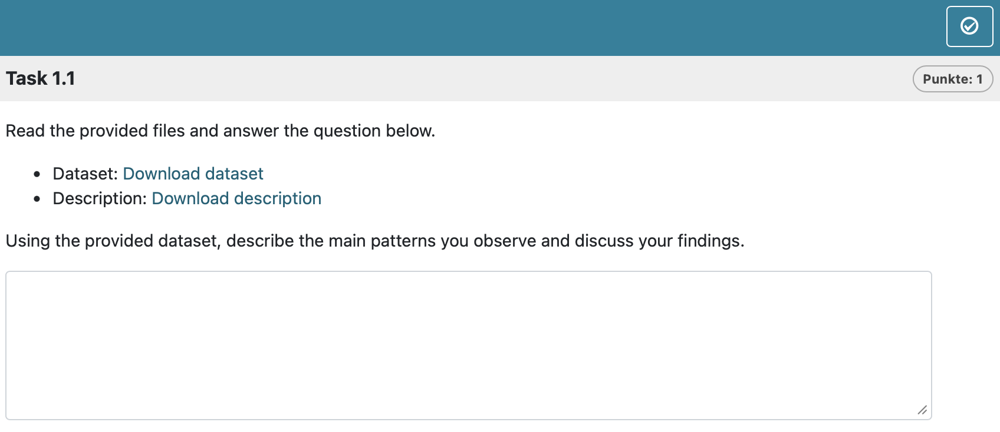

```{r api, include = FALSE}
knitr::opts_chunk$set(
  collapse = TRUE,
  comment = "#>",
  message = FALSE,
  warning = FALSE
)
source("helper.R")
```
```{r setup api opal, echo=FALSE}
library(rqti)
```

`r if(knitr::is_latex_output()) "# Embedding resources"`

## Embedding files in R Markdown tasks

In some assessment scenarios, it is useful to provide additional materials directly within a task, such as datasets, PDFs, or supplementary documents.

The `rqti` package provides the helper function `provide_file()` for this purpose.
The function embeds a local file into the rendered output by encoding it as Base64 and creating a downloadable hyperlink.
This means that the file is included directly in the task and does not need to be hosted externally. 
This approach is especially useful when tasks are exported to learning management systems, as all required resources are bundled within the task itself.

The following example demonstrates how `provide_file()` can be used inside an .Rmd task.
In this case, two files are embedded and offered to the user as downloadable resources.

````{r, echo=FALSE, results='asis'}
txt <- '
---
title: "Essay with embedded files"
type: essay
knit: rqti::render_qtijs
---

```{r}
library(rqti)
```

# question

Read the provided files and answer the question below.

- Dataset: \`r provide_file("data.csv", label = "Download dataset")\`
- Description: \`r provide_file("description.pdf", label = "Download description")\`

Using the provided dataset, describe the main patterns you observe and discuss your findings.
'
cat("````markdown\n")
cat(txt)
cat("\n````")
````

In this example:

* `provide_file("data.csv")` embeds a dataset directly into the task

* `provide_file("description.pdf")` embeds an additional document

* The links are rendered as standard HTML `<a>` elements with embedded data

* When the task is exported, both files are included without requiring external references

* The inline usage via r ... ensures that the links are generated dynamically during rendering.

In OPAL this renders as `r ltx("shown in Figure \\ref{essay_files2opal}.", ":")`

{width=100%}

### Notes

* Files should be reasonably small, as they are embedded directly into the document

* The label argument can be used to control the displayed link text

* If no label is provided, the file name is used by default

* MIME types are detected automatically, but can be specified manually if needed


## Embedding images

Images in .Rmd tasks are handled in the same way as other external resources.

Images are embedded regardless of how they are created or referenced in the .Rmd file (e.g., ``) or generated programmatically (e.g., plots in R chunks).
In all cases, the image data is encoded in Base64 and stored directly in the XML, making the task fully self-contained without external dependencies.


