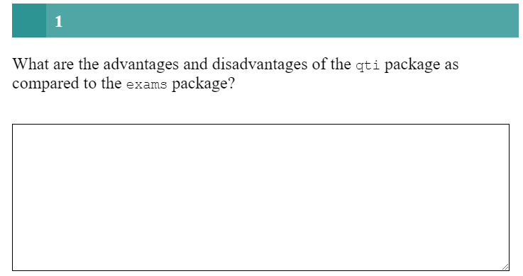
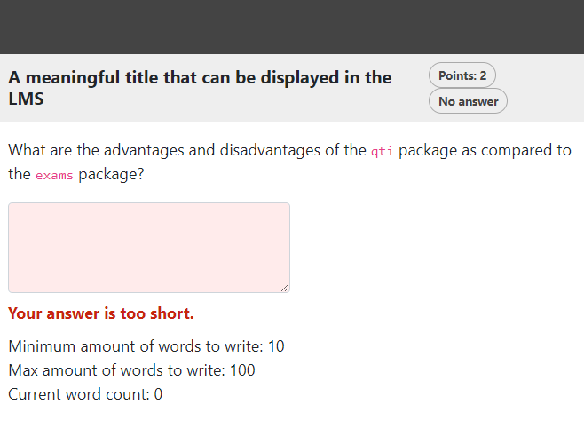

```{r, include = FALSE}
knitr::opts_chunk$set(
  collapse = TRUE,
  comment = "#>"
)
```

```{r setup, echo=FALSE}
library(qti)
```

## Minimum version

This type of exercise is an open question and refers to an assessment task that allows the candidate to give an answer in a free form without predefined answer options or formats. A template is available in RStudio when you click on `New file -> R Markdown -> From Template`. The qti templates start with `QTI:`. Here we look at the templates `QTI: essay (simple)`
and `QTI: essay (complex)`.

The minimum you need to provide is the `type: essay` in the yaml-section and some text as a task description in a section called **\#question**:

```{r comment='', echo = F}
cat(readLines(fs::path_package("rmarkdown/templates/essay-simple/skeleton", "skeleton.Rmd", package = "qti")), sep = '\n')
```

Note that in this example, a feedback section was also provided. Since only
manual review is possible in this type of exercise, only general feedback is
reasonable, which will be shown after the answer is submitted. The feedback is
optional, but usually it is a good idea to give some explanation for students.

Further note that the `knit` parameter is set to the custom qti knit function,
which will handle the preview. Clicking the Knit button in RStudio produces the
following in the viewer pane (or browser of your choice):

{width="400"}

## More control

If you want to have more fine-grained control, consider the RMD template `QTI: essay (complex)`, wich uses more yaml attributes.

```{r comment='', echo = F}
cat(readLines(fs::path_package("rmarkdown/templates/essay-complex/skeleton", "skeleton.Rmd", package = "qti")), sep = '\n')
```

Which renders as:

{width="400"}

## yaml attributes

### type

Has to be `essay`.

### identifier

This is the id of the exercise, useful for later data analysis of results. The default is the file name. If you are doing extensive data analysis later on it makes sense to
specify a meaningful identifier. In all other cases, the file name should be
fine.

### title

Title of the exercise. Can be displayed to students depending on
the learning management system settings. Default is the file name.

### points

How many points are given for the whole exercise. Default is 1. 

### expected_length

Defines the width of the text input field.

### expected_lines

Defines the number of lines of the text input field.

### max_strings

Defines the maximum number of words that can be written by the candidate in the text input field.

### min_strings

Defines the minimum number of words that can be written by the candidate in the text input field.

### data_allow_paste

Determines whether the candidate is allowed to copy text from the clipboard to the text input field. Default is `FALSE`.

## Feedback

Feedback can be provided with the section

-   **\# feedback** (general feedback, displayed every time, without conditions)

## Some advice on essay exercises 

TODO
