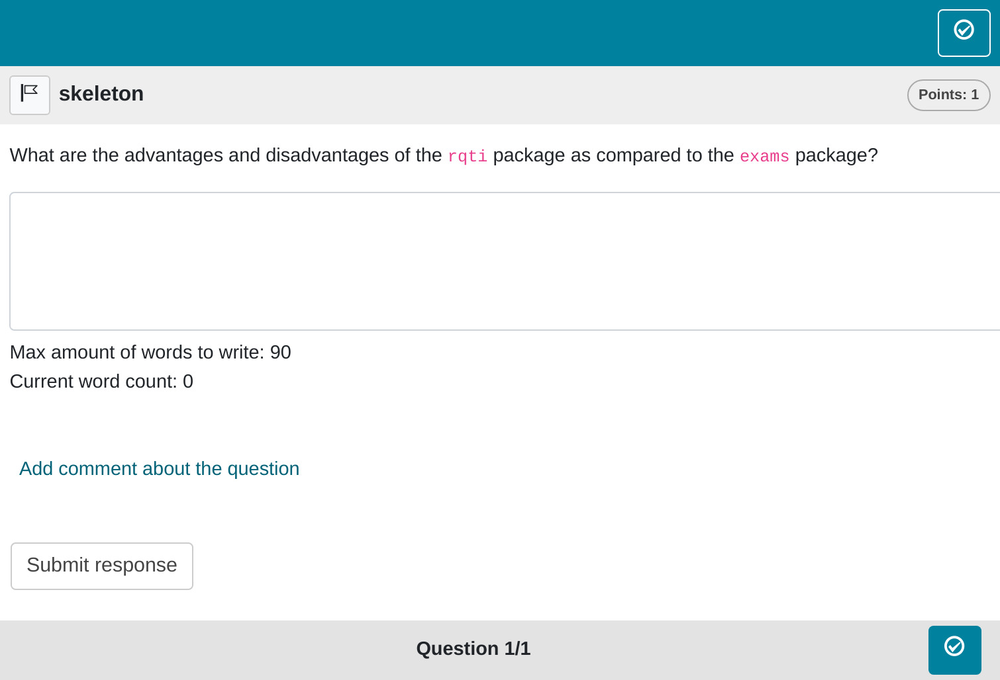

```{r, include = FALSE}
knitr::opts_chunk$set(
  collapse = TRUE,
  comment = "#>"
)
```

```{r setup, echo=FALSE}
library(qti)
```

## Minimum version

This is just a typical essay exercise. A template is available in RStudio when you click on `New file -> R Markdown -> From Template`. The qti templates start with `QTI:`. Here we look at the templates `QTI: essay (simple)` and `QTI: essay (complex)`.

The minimum you need to provide is the `type: essay` in the yaml-section and some text as a task description in a section called **\#question**:

```{r comment='', echo = F}
cat(readLines(fs::path_package("rmarkdown/templates/essay-simple/skeleton", "skeleton.Rmd", package = "qti")), sep = '\n')
```

Knitting via the Knit-Button to qtijs, this exercise renders as:


Alternatively, change the knit parameter to `knit: render_opal` (see [API Opal](opal_api)) to upload to Opal directly, producing:



Note that in this example, a feedback section was also provided. Since an open question requires manual review, only general feedback without conditions should be provided. The feedback is optional, but usually it is a good idea to give some explanation for students. Furthermore, a feedback section for essay exercises can serve as a good basis for grading student's answers.

## More control

If you want to have more fine-grained control, consider the RMD template `QTI: essay (complex)`, wich uses more yaml attributes.

```{r comment='', echo = F}
cat(readLines(fs::path_package("rmarkdown/templates/essay-complex/skeleton", "skeleton.Rmd", package = "qti")), sep = '\n')
```

Which on Opal renders as:


## yaml attributes

### type

Has to be `essay`.

### identifier

This is the ID of the exercise, useful for later data analysis of results. The default is the file name. If you are doing extensive data analysis later on it makes sense to specify a meaningful identifier. In all other cases, the file name should be fine.

### title

Title of the exercise. Can be displayed to students depending on the learning management system settings. Default is the file name.

### points

How many points are given for the whole exercise. Default is 1. 

### expected_length

Defines the width of the text input field.

### expected_lines

Defines the number of lines of the text input field.

### max_strings

Defines the maximum number of words that can be written by the candidate in the text input field.

### min_strings

Defines the minimum number of words that must be written by the candidate in the text input field.

### data_allow_paste

Determines whether the candidate is allowed to copy text from the clipboard to the text input field. Default is `FALSE`.

## Feedback

Feedback can be provided with the section

-  **\# feedback** (general feedback, displayed every time, without conditions)

The feedback plays an important role in essay exercises because the expected length and maximum words are calculated from the feedback section, if one is given. Providing useful feedback also defines explicit criteria for grading, so do not skip it for essay exercises, unless you have good reasons to.

## Some advice on essay exercises

Essay exercises can be one of the best exercises if the instructor asks a good question. Unfortunately, many instructors are not very creative and unspecific when they come up with essay questions. This often leads to vague criteria for grading. To avoid this, always write an ideal solution in the feedback section. Your students and colleagues will thank you.
