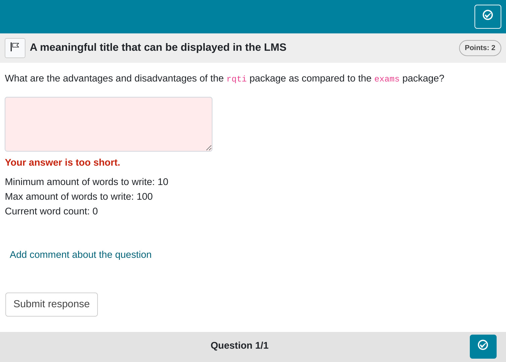

```{r essay, include = FALSE}
knitr::opts_chunk$set(
  collapse = TRUE,
  comment = "#>"
)
source("helper.R")
```

```{r setup essay, echo=FALSE}
library(rqti)
```

`r if(knitr::is_latex_output()) "# Essay tasks"`

This is a standard essay task with an open field for students to write a comprehensive response.

## Minimum version

A minimum template is automatically created when you initiate an rqti project through RStudio. Alternatively, it can be added by clicking on `New file -> R Markdown -> From Template`. The `rqti` templates end with `{rqti}` Here we look at the templates ` essay (simple)` and ` essay (complex)`.

The minimum you need to provide is the `type: essay` in the yaml-section and some text as a task description in a section called **\#question**:

```{r comment='', echo = F}
cat(readLines(fs::path_package("rmarkdown/templates/essay-simple/skeleton", "skeleton.Rmd", package = "rqti")), sep = '\n')
```

Knitting via the Knit-Button to qtijs, this task renders as`r ltx(" shown in Figure \\ref{essay1qtijs}.", ":")`

{width=100%}

Alternatively, change the knit parameter to `knit: rqti::render_opal` (see [Working with the OPAL API](api_opal.html)) to upload to Opal directly, producing`r ltx(" the output in Figure \\ref{essay1opal}.", ":")`

{width=100%}

Note that in this example, a feedback section was also provided. Since an open question requires manual review, only general feedback without conditions should be provided. The feedback is optional, but usually it is a good idea to give some explanation for students. Furthermore, a feedback section for essay tasks can serve as a good basis for grading student's answers. In addition the length of the feedback section is taken into account in constructing the text field and the maximum number of words. If no feedback is provided, sensible defaults are used.

## More control

If you want to have more fine-grained control, consider the RMD template `essay (complex)`, which uses more yaml attributes.

```{r comment='', echo = F}
cat(readLines(fs::path_package("rmarkdown/templates/essay-complex/skeleton", "skeleton.Rmd", package = "rqti")), sep = '\n')
```

Which, in Opal, renders as `r ltx("shown in Figure \\ref{essay2opal}.", ":")`

{width=100%}

## yaml attributes

### type

Has to be `essay`.

### identifier

This is the ID of the task, useful for later data analysis of results. The default is the file name. If you are doing extensive data analysis later on it makes sense to specify a meaningful identifier. In all other cases, the file name should be fine.

### title

Title of the task. Can be displayed to students depending on the learning management system settings. Default is the file name.

### points

How many points are given for the whole task. Default is 1. 

### expected_length

Defines the width of the text input field.

### expected_lines

Defines the number of lines of the text input field.

### words_max

Defines the maximum number of words that can be written by the candidate in the text input field.

### words_min

Defines the minimum number of words that must be written by the candidate in the text input field.

### data_allow_paste

Determines whether the candidate is allowed to copy text from the clipboard to the text input field. Default is `false`.

## Feedback

Feedback can be provided with the section

-  **\# feedback** (general feedback, displayed every time, without conditions)

The feedback plays an important role in essay tasks because the expected length and maximum words are calculated from the feedback section, if one is given. Providing useful feedback also defines explicit criteria for grading, so do not skip it for essay tasks, unless you have good reasons to.

Further note that it does not make sense to give conditional feedback as essay tasks have to be graded manually.

## Some advice on essay tasks

Essay tasks can be highly diagnostic, especially when instructors pose thought-provoking questions. Unfortunately, many instructors struggle with creativity and precision when crafting essay prompts, leading to vague grading criteria. To address this issue, it is recommended to always include an exemplary solution in the feedback section. This not only enhances the learning experience for students but also earns appreciation from colleagues involved in grading.
