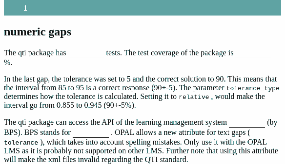

```{r, include = FALSE}
knitr::opts_chunk$set(
  collapse = TRUE,
  comment = "#>"
)
```

```{r setup, echo=FALSE}
library(qti)
```

## Minimum version

In this type of exercise, the candidate is asked to fill in one or several gaps. In our opinion, this is the best way to test the ability of students because guessing is more difficult than with forced choice answers. Focus on gap exercises and you will be rewarded with better properties of your tests.

In our package it is possible to combine gaps with text and numeric answers in a single exercise. A template is available in RStudio when you click on `New file -> R Markdown -> From Template`. The qti templates start with `QTI:`. Here we look at the templates `QTI: gap (simple)` and `QTI: gap (complex)`.

The minimum you need to provide is the `type: gap` (or the equivalent `type: cloze`) in the yaml-section and some text, where at least one gap is used, in a section called  **\#question**:

```{r comment='', echo = F}
cat(readLines(fs::path_package("rmarkdown/templates/gap-simple/skeleton", "skeleton.Rmd", package = "qti")), sep = '\n')
```

Clicking on the Knit-button will produce the following in the viewer pane:



Alternatively, change the knit parameter to `knit: render_opal` (see [API Opal](opal_api)) to upload to opal directly, producing:


As you can see, there are two ways to create a gap in Rmd content:

- Put the right answer inside `<<` ... `>>` (or the equivalent `<gap>` ... `</gap>`). Example: `<<3.14>>` or `<<sometext>>`
- use the helper functions [`gap_numeric`](#gapnumeric) and [`gap_text`](#gaptext) (see details below)

By default, 1 point can be reached for each gap (specify `points` to your needs). The total number of points for completing a task is defined as the sum of points of all gaps.

Note that in this example, a feedback section was also provided. The feedback is
optional, but usually it is a good idea to give some explanation for students. In gap exercises the feedback refers to the whole task, not to a specific gap. Group your feedback into appropriate sections, which can be opened/closed for better user experience (use details and summary html tags).

## More control

If you want to have more fine-grained control, consider the RMD template `QTI: gap (complex)`, wich uses more yaml attributes and more complex calls of the helper functions.

```{r comment='', echo = F}
cat(readLines(fs::path_package("rmarkdown/templates/gap-complex/skeleton", "skeleton.Rmd", package = "qti")), sep = '\n')
```

In Opal this renders as:


# yaml attributes

### type

Has to be `gap` or `cloze`.

### identifier

This is the id of the exercise, useful for later data analysis of results. The default is the file name. If you are doing extensive data analysis later on it makes sense to
specify a meaningful identifier. In all other cases, the file name should be
fine.

### title

Title of the exercise. Can be displayed to students depending on
the learning management system settings. Default is the file name.

## Feedback

Feedback can be provided with the section

-   **\# feedback** (general feedback, displayed every time, without conditions)
-   **\# feedback+** (only provided if student reaches all points)
-   **\# feedback-** (only provided if student does not reach all points)

## Helper function `gap_numeric` {#gapnumeric}

This helper function is designed to generate a formatted string describing a gap in Rmd content, where the answer has a numeric type:

```{r results="plaintext", comment=""}
gap1 <- gap_numeric(solution = 1.4, tolerance = 10, tolerance_type = "relative",
                    score = 5, response_identifier = "mean_value",
                    include_lower_bound = TRUE, include_upper_bound = TRUE,
                    expected_length = 10, placeholder = "put mean value here")
cat(gap1)
```

As you can see, we also use yaml in the end, but for most users it is more convenient to have a specific R function instead.

Argument list of `gap_numeric`:

### solution

Correct numeric answer.

### tolerance

Determines the boundaries of values within which the answer is considered as correct.

### tolerance_type

Determines how the tolerance is calculated. If we have `solution = 50` and `tolerance 10`:

- setting `tolreance_type` to `relative`, would make the interval of the correct answser go from 45 to 55 (50+-10%)
- setting it to `absolute`, produces the interval between 40 and 60 (50+-10)

### points

The number of points for this gap. Default is 1.

### response_identifier

This is the ID of the gap, useful for later data analysis. The default has the format "response_1", "response_2". If you are doing extensive data analysis later on, it makes sense to specify a meaningful identifier.

### include_lower_bound

Specifies whether or not the lower bound is included in the tolerance interval

### inclue_upper_bound

Specifies whether or not the upper bound is included in the tolerance interval

### expected_length	

Sets a size of text input field in content delivery engine. This value is not assigned directly, but calculated according to the number of symbols of the solution value. The browsers display it inconsistently, but we tried to create sensible defaults.

### placeholder

Text displayed in the gap, before an answer is attempted. Can be used for hints (e.g. *numbers only*).

## Helper function `gap_text` {#gaptext}

This helper function is designed to generate a formatted string describing a gap in Rmd content, where the answer is a string/character:

```{r results="plaintext", comment=""}
gap2 <- gap_text(gap_text(c("Bildungsportal Sachsen", "Bildungs Portal Sachsen"), tolerance = 4, case_sensitive = FALSE, placeholder = "text without special characters", expected_length = 25))
cat(gap2)
```

Argument list of `gap_text`:

### solution

Determines a string vector of values that are considered as correct answers.

### tolerance (works only in LMS OPAL)

Defines how many characters will be taken into account to tolerate spelling mistakes.

### case_sensitive (works only in LMS OPAL)

Determines whether the evaluation of the correct answer is case sensitive. Default is `FALSE`.

### points

The number of points for this gap. Default is 1.

### response_identifier

This is the ID of the gap, useful for later data analysis. The default has the format "response_1", "response_2". If you are doing extensive data analysis later on, it makes sense to specify a meaningful identifier.


### expected_length	

Sets a size of text input field in content delivery engine. This value is not assigned directly, but calculated according to the number of symbols of the solution value. The browsers display it inconsistently, but we tried to create sensible defaults.

### placeholder

Text displayed in the gap, before an answer is attempted. Can be used for hints (e.g. *numbers only*).

## Some advice on gap exercises 

You cannot do much wrong with gap exercises. They are perfect because they reduce guessing and often have reasonably high difficulty. Numeric exercises usually involve calculations that often cannot be guessed at all. Text gaps are more difficult to create, but you can provide several alternative solutions and with Opal you can even take into account spelling mistakes. Obviously, you can also make bad gap exercises, so be mindful.

Another hint: If you want to combine single choice questions with gaps in one exercise, simply use a numeric gap for the single choice questions and provide the solutions in the question. For instance, ____ (0 = not significant, 1 = significant). This way, you can use gaps for all questions. They are very flexible.
