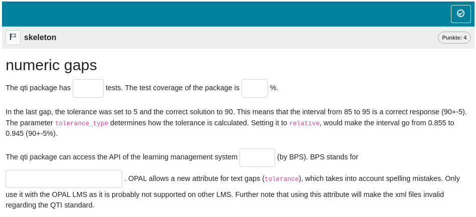
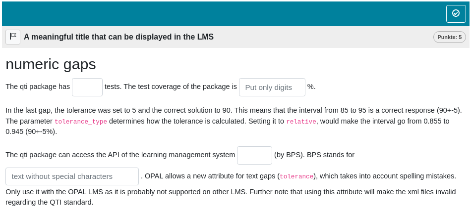

```{r gap, include = FALSE}
knitr::opts_chunk$set(
  collapse = TRUE,
  comment = "#>"
)
source("helper.R")
```

```{r setup gap, echo=FALSE}
library(rqti)
```

`r if(knitr::is_latex_output()) "# Gap tasks"`

In this task format, candidates are required to fill in one or more gaps. We believe this method is one of the most effective ways to assess students' abilities, as it reduces the likelihood of guessing compared to multiple-choice questions. Emphasizing gap-fill tasks often leads to more reliable assessment outcomes.

Our package allows for the integration of both textual and numeric responses within a single task, offering instructors greater flexibility in designing assessments.

## Minimum version

A minimum template is automatically created when you initiate an rqti project through RStudio. Alternatively, it can be added by clicking on `New file -> R Markdown -> From Template`. The `rqti` templates end with `{rqti}`. Here we look at the templates ` gap (simple)` and ` gap (complex)`.

The minimum you need to provide is the `type: gap` (or the equivalent `type: cloze`) in the yaml-section and some text, where at least one gap is used, in a section called  **\#question**. Furthermore, when employing helper functions from the rqti package, it is essential to ensure its prior loading.

```{r comment='', echo = F}
cat(readLines(fs::path_package("rmarkdown/templates/gap-simple/skeleton", "skeleton.Rmd", package = "rqti")), sep = '\n')
```

Clicking on the Knit-button will produce`r ltx(" the output in Figure \\ref{gap1qtijs}.", ":")`

{width=100%}

Alternatively, change the knit parameter to `knit: rqti::render_opal` (see article \ref{working-with-the-opal-api} [Working with the OPAL API](api_opal.html)) to upload to OPAL directly, producing`r ltx(" the output in Figure \\ref{gap1opal}.", ":")`

{width=100%}

As you can see, there are two ways to create a gap in an Rmd file:

- Put the correct answer between `<<` ... `>>` (or the equivalent `<gap>` ... `</gap>`). Example: `<<3.14>>` or `<<sometext>>`
- use the helper functions `?gap_numeric` and `?gap_text` (also see details below, section \ref{gaptext} [Helper function gap text](#gaptext), \ref{gapnumeric} [Helper function gap numeric](#gapnumeric))

By default, 1 point can be reached for each gap (specify `points` in the helper function to your needs). The total number of points for completing a task is defined as the sum of points of all gaps.

Note that in this example, a feedback section was also provided. The feedback is
optional, but usually it is a good idea to give some explanation for students. In gap tasks the feedback refers to the whole task, not to a specific gap. Group your feedback into appropriate sections, which can be opened/closed for better user experience (use `<details>` and `<summary>` html tags).

A great way to do this is to use `<details>` and `<summary>` html tags:

```{html}
<details><summary>Question1</summary>
  Provide Feedback for Question 1
</details>
<details><summary>Question 2</summary>
  Provide Feedback for Question 2
</details>
```


will render as:

```{=html}
<details><summary> Question 1</summary>
  Provide Feedback for Question 1
</details>
<details><summary> Question 2</summary>
  Provide Feedback for Question 2
</details>
```

```{=latex}
\textrightarrow{} Question 1\\
\textrightarrow{} Question 2\\

By clicking on the arrows, the details will unfold.
```

## More control

If you want to have more fine-grained control, consider the RMD template ` gap (complex)`, which uses more yaml attributes and more complex calls of the helper functions.

```{r comment='', echo = F}
cat(readLines(fs::path_package("rmarkdown/templates/gap-complex/skeleton", "skeleton.Rmd", package = "rqti")), sep = '\n')
```

In Opal this renders as `r ltx("shown in Figure \\ref{gap2opal}.", ":")`

{width=100%}

## yaml attributes

### type

Has to be `gap` or `cloze`.

### identifier

This is the ID of the task, useful for later data analysis of results. The default is the file name. If you are doing extensive data analysis later on it makes sense to
specify a meaningful identifier. In all other cases, the file name should be
fine.

### title

Title of the task. Can be displayed to students depending on
the learning management system settings. Default is the file name.

## Feedback

Feedback can be provided with the section

-   **\# feedback** (general feedback, displayed every time, without conditions)
-   **\# feedback+** (only provided if student reaches all points)
-   **\# feedback-** (only provided if student does not reach all points)

## Helper function `gap_numeric` {#gapnumeric}

This helper function is designed to generate a formatted string describing a gap in Rmd content, where the answer has a numeric type:

```{r results="plaintext", comment=""}
gap1 <- gap_numeric(solution = 1.4, tolerance = 10, tolerance_type = "relative",
                    points = 5, response_identifier = "mean_value",
                    include_lower_bound = TRUE, include_upper_bound = TRUE,
                    expected_length = 10, placeholder = "put mean value here")
cat(gap1)
```

As you can see, YAML is ultimately used, but for most users, it is more convenient to have a dedicated R function instead. Let us now look at the argument list of `gap_numeric`:

### solution

Correct numeric answer.

### tolerance

Defines the range of values within which an answer is deemed correct.

### tolerance_type

Defines how the tolerance is calculated. For instance, if the solution is 50 and the tolerance is 10:

- Setting `tolerance_type` to `relative` results in a correct answer range from 45 to 55 (50 ± 10%).
- Setting it to `absolute` creates a range from 40 to 60 (50 ± 10).

### points

The number of points for this gap. Default is 1.

### response_identifier

This is the ID of the gap, useful for later data analysis. The default has the format "response_1", "response_2". If you are doing extensive data analysis later on, it makes sense to specify a meaningful identifier.

### include_lower_bound

Specifies whether the lower bound is included in the tolerance interval.

### inclue_upper_bound

Specifies whether the upper bound is included in the tolerance interval.

### expected_length	

Specifies the size of the text input field in the content delivery engine. This value is not directly assigned, it is calculated based on the number of symbols in the solution value. Browsers display the input field length inconsistently, but we have endeavored to establish sensible defaults.

### placeholder

Text displayed in the gap, before an answer is attempted. Can be used for hints (e.g. *numbers only*).

## Helper function `gap_text` {#gaptext}

This helper function is designed to generate a formatted string describing a gap in Rmd content, where the answer is a string:

```{r results="plaintext", comment=""}
gap2 <- gap_text(gap_text(c("Bildungsportal Sachsen", "Bildungs Portal Sachsen"),
                          tolerance = 4, case_sensitive = FALSE, 
                          placeholder = "text without special characters",
                          expected_length = 25))
cat(gap2)
```

Argument list of `gap_text`:

### solution

Determines a string vector of values that are considered as correct answers.

### tolerance (works only in LMS OPAL)

Defines how many characters will be taken into account to tolerate spelling mistakes. The exact algorithm of OPAL is unclear.

### case_sensitive (works only in LMS OPAL)

Determines whether the evaluation of the correct answer is case sensitive. Default is `FALSE`.

### points

The number of points for this gap. Default is 1.

### response_identifier

This is the ID of the gap, useful for later data analysis. The default has the format "response_1", "response_2". If you are doing extensive data analysis later on, it makes sense to specify a meaningful identifier.


### expected_length	

Specifies the size of the text input field in the content delivery engine. The default value is calculated based on the number of symbols in the solution value. Browsers display the input field length inconsistently, but we have endeavored to establish sensible defaults. Please adjust to your needs.

### placeholder

Text displayed in the gap, before an answer is attempted. Can be used for hints (e.g. *numbers only*).

## Some advice on gap tasks 

Gap tasks are generally foolproof, offering an ideal format by minimizing guessing and often presenting a reasonably high level of difficulty. Numeric tasks, involving calculations that are typically not guessable, are especially effective. While crafting text gaps may be more intricate, the option to offer multiple alternative solutions and leverage OPAL to accommodate spelling errors enhances their versatility. Nevertheless, it is important to note that, like any task, gap tasks can be poorly designed, so be mindful in their creation.

As mentioned earlier, numeric and text gaps can be combined in a single task, making them quite versatile. In fact, the flexibility of gaps allows for the integration of various task types within a single task. For instance, to incorporate single-choice questions alongside gaps, you can use a numeric gap for the single-choice question and include the answer options directly in the question. For example, "Fill in the blank: ____ (0 = not significant, 1 = significant)". This approach enables you to use gaps for many types of questions, highlighting their exceptional adaptability.
