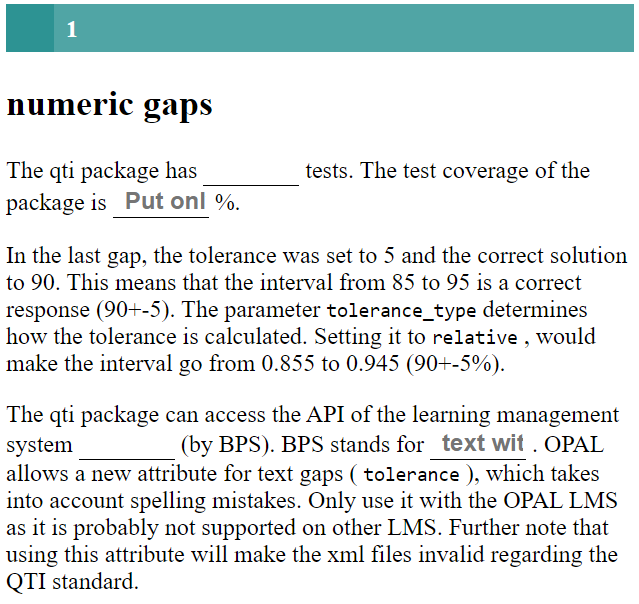
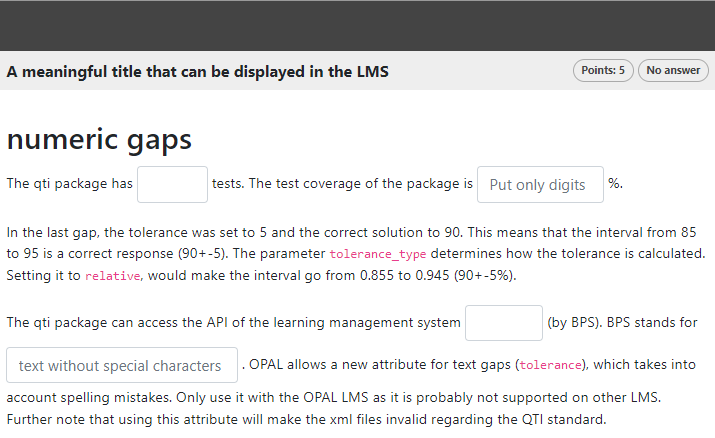

```{r, include = FALSE}
knitr::opts_chunk$set(
  collapse = TRUE,
  comment = "#>"
)
```

```{r setup}
library(qti)
```

## Minimum version

In this type of exercise, the candidate is asked to fill in the gaps. It is possible to combine gaps with text and numeric answers in one task. A template is available in RStudio when you click on `New file -> R Markdown -> From Template`. The qti templates start with `QTI:`. Here we look at the templates `QTI: gap (simple)` and `QTI: gap (complex)`.

The minimum you need to provide is the `type: gap` (or the equivalent `type: cloze`) in the yaml-section and some text, where at least one gap is formed, in a section called  **\#question**:

```{r comment='', echo = F}
cat(readLines(fs::path_package("rmarkdown/templates/gap-simple/skeleton", "skeleton.Rmd", package = "qti")), sep = '\n')
```

There are 2 ways to denote a gap-element in Rmd content:

- put inside `<<` ... `>>` (or the equivalent `<gap>` ... `</gap>`) the right answer. Example: `<<3.14>>` or `<<mean>>`
- use the helper functions `gap_numeric` and `gap_text` (see more details below)

By default, each gap gives 1 point for the correct answer. The total number of points for completing a task is defined as the sum of points for each dropdown-element.


Note that in this example, a feedback section was also provided. The feedback is
optional, but usually it is a good idea to give some explanation for students. In this type of exercise the feedback relates to the whole task, not to a specific gap.

Further note that the `knit` parameter is set to the custom qti knit function,
which will handle the preview. Clicking the Knit button in RStudio produces the
following in the viewer pane (or browser of your choice):

{width="400"}

## More control

If you want to have more fine-grained control, consider the RMD template `QTI: gap (complex)`, wich uses more yaml attributes.

```{r comment='', echo = F}
cat(readLines(fs::path_package("rmarkdown/templates/gap-complex/skeleton", "skeleton.Rmd", package = "qti")), sep = '\n')
```

Which renders as:

{width="700"}

# yaml attributes

### type

Has to be `gap` or `cloze`.

### identifier

This is the id of the exercise, useful for later data analysis of results. The default is the file name. If you are doing extensive data analysis later on it makes sense to
specify a meaningful identifier. In all other cases, the file name should be
fine.

### title

Title of the exercise. Can be displayed to students depending on
the learning management system settings. Default is the file name.

## Feedback

Feedback can be provided with the section

-   **\# feedback** (general feedback, displayed every time, without conditions)
-   **\# feedback+** (only provided if student reaches all points)
-   **\# feedback-** (only provided if student does not reach all points)

## Helper function `gap_numeric`

This helper function `gap_numeric` provides the formation of a string describing  a gap with numeric answer in Rmd content:

```{r results="plaintext", comment=""}
gap1 <- gap_numeric(solution = 1.4, tolerance = 10, tolerance_type = "relative",
                    score = 5, response_identifier = "mean_value",
                    include_lower_bound = TRUE, include_upper_bound = TRUE,
                    expected_length = 10, placeholder = "put mean value here")
cat(gap1)
```
Argument list of `gap_numeric`:

### solution

Number as a right answer.

### tolerance

Determines the boundaries of values within which the answer is considered as correct.

### tolerance_type

Determines how the tolerance is calculated. If we have `solution = 50` and `tolerance 10`:
- setting `tolreance_type` to `relative`, would make the interval of right answser from 45 to 55 (50+-10%)
- setting to `absolute`, would make the right answer in interval from 40 to  60 (50+-10)

### score

The number of points for this gap. Default is 1.

### response_identifier

This is the id of the gap-element, useful for later data analysis of results. The default has format as "response_1". If you are doing extensive data analysis later on, it makes sense to specify a meaningful identifier.

### include_lower_bound

Specifies whether or not the lower bound is included in tolerance interval

### inclue_upper_bound

Specifies whether or not the upper bound is included in tolerance interval

### expected_length	

Sets a size of text input field in content delivery engine. If it is not assigned, it is calculated according to the number of symbols of the solution value.

### placeholder

Some helpful text in the text field.

## Helper function `gap_text`

This helper function `gap_text` provides the formation of a string describing  a gap with string answer in Rmd content:

```{r results="plaintext", comment=""}
gap2 <- gap_text(gap_text(c("Bildungsportal Sachsen", "Bildungs Portal Sachsen"), tolerance = 4, case_sensitive = FALSE, placeholder = "text without special characters", expected_length = 25))
cat(gap2)
```
Argument list of `gap_text`:

### solution

Determines a string vector of values that are considered as correct answers.

### tolerance (works on LMS OPAL)

Defines how many characters will be taken into account to tolerate spelling mistake.

### case_sensitive (works on LMS OPAL)

Determines whether the evaluation of the correct answer is case sensitive. Default is `TRUE`.

### score

The number of points for this gap. Default is 1.

### response_identifier

This is the id of the gap-element, useful for later data analysis of results. The default has format as "response_1". If you are doing extensive data analysis later on, it makes sense to specify a meaningful identifier.

### expected_length	

Sets a size of text input field in content delivery engine. If it is not assigned, it is calculated according to the number of characters of the solution value.

### placeholder

Some helpful text in the text field.

## Some advice on essay exercises 

TODO
