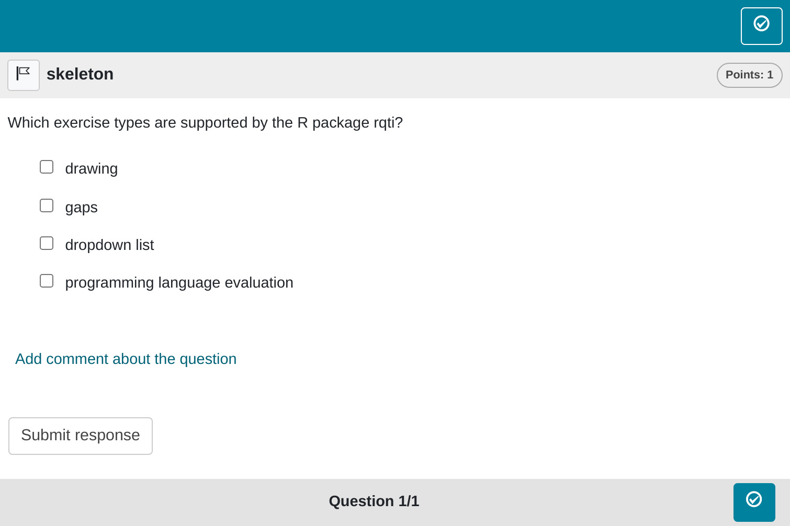
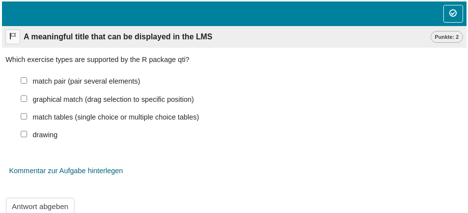

```{r mpc, include = FALSE}
knitr::opts_chunk$set(
  collapse = TRUE,
  comment = "#>"
)
source("helper.R")
```

```{r setup, echo=FALSE}
library(rqti)
```

`r if(knitr::is_latex_output()) "# Multiple-Choice Exercises"`

This is just a normal multiple choice exercise. 

## Minimum version

A minimum template is automatically created when you initiate an rqti project through RStudio. Alternatively, it can be added by clicking on `New file -> R Markdown -> From Template`. The `rqti` templates end with `{rqti}`. Here we look at the templates `multiplechoice (simple)` and `multiplechoice (complex)`.

The minimum you need to provide is the `type: mpc` (or the equivalent `type: multiplechoice` or `type: mchoice`) in the yaml-section and a list with at least two elements in a section called **\# question**:

```{r comment='', echo = F}
cat(readLines(fs::path_package("rmarkdown/templates/multiplechoice-simple/skeleton",
                               "skeleton.Rmd",
                               package = "rqti")), sep = '\n')
```

Note that in this example, a feedback section was also provided. This is optional, but usually it is a good idea to give some explanation for students.

Further note that the `knit` parameter is set to the custom `rqti` knit function, which will handle the preview. Clicking the Knit button in RStudio produces`r ltx(" the output in Figure \\ref{mpc1qtijs}.", ":")`

{width=100%}

You can also use the Opal (set it up before, see article \ref{working-with-the-opal-api} [Working with the OPAL API](api_opal.html)) render function (`knit: rqti::render_opal`), which should produce`r ltx(" the output in Figure \\ref{mpc1opal}.", ":")`

{width=100%}

Multiple-choice exercises function similarly to single-choice exercises, with the key difference being that multiple (or no) answers can be correct. To indicate the correct options, surround them with asterisks (using markdown for italics). If you need to use italics within the choices themselves, enclose the entire question in `<em></em>` tags to avoid conflicts.

By default, the total points available for a question are calculated as $0.5n$, where $n$ is the number of answer choices. For example, if there are 4 choices, the maximum score for the question is 2 points. Correct selections earn 0.5 points each, while incorrect selections deduct 0.5 points. Regardless of how points are calculated, the minimum score you can receive is 0.

Among various grading options, we find this to be the most intuitive, especially when considering the element of guessing. Given our inclination against forced-choice exercises, we do not see significant value in introducing different grading alternatives. Rather, we recommend directing attention towards better exercise types like gaps for a more effective assessment approach. See also the section \ref{some-advice-on-multiple-choice-exercises} [Some advice on multiple choice exercises].

## More control

If you want to have more fine-grained control, consider the available attributes for the yaml section in the RMD template `multiple-choice (complex)`.

```{r comment='', echo = F}
cat(readLines(fs::path_package("rmarkdown/templates/multiplechoice-complex/skeleton/", "skeleton.Rmd", package = "rqti")), sep = '\n')
```

Which renders in OPAL as`r ltx(" shown in Figure \\ref{mpc2opal}.", ":")`

{width=100%}

Let us now discuss all yaml attributes that can be used.

## yaml attributes

### type

Has to be `multiplechoice` or `mpc` or `mchoice` (compatible with `exams` package).

### identifier

This is the ID of the exercise, useful for later data analysis of results. The default is the file name. If you are doing extensive data analysis later on, it makes sense to specify a meaningful identifier. In all other cases, the file name should be fine.

### title

Title of the exercise. Can be displayed to students depending on the learning management system settings. The default is the file name.

### shuffle

If `true`, randomizes the order of the choices. Defaults to `true`. Only in rare occasions it makes sense to have a strict order of choices (setting shuffle to `false`).

### orientation

Should the items be displayed in `vertical` or `horizontal` mode? Default is `vertical`.

<!-- TODO, is this really possible? or do we always use points instead? -->
<!-- ### solution -->

<!-- An alternative way to specify the correct solution is by giving the integer of the correct choice. Usually not needed and less intuitive than specifying the correct choices directly in the list of all choices (see above). -->

### points

How many points are given for the whole exercise. Default is the number of choices times 0.5. The points $p$ are divided by the number of choices $c$ and then distributed over all choices. A correct choice will get the student +$p/c$, an incorrect choice -$p/c$. Witout such a procedure, a student could always select all answers and get the maximum number of points. See also the section \ref{some-advice-on-multiple-choice-exercises} [Some advice on multiple choice exercises].

## Feedback

Feedback can be provided with the section

- **\# feedback** (general feedback, displayed every time, without conditions)
- **\# feedback+** (only provided if student reaches all points)
- **\# feedback-** (only provided if student does not reach all points)

## List of answers as a variable

For more complex exercises the list of answers is often just available as a variable. In this case you can use the helper function `mdlist` to convert the vector into a markdown list:

```{r results="plaintext", comment=""}
mdlist(c("dropdown list", "programming language evaluation", "numeric gap"), 
       solutions = c(1, 3))
```

## Some advice on multiple choice exercises

A multiple-choice exercise can always be converted into multiple single-choice questions with true/false or yes/no options. From a psychometric standpoint, both types of exercises share the same drawbacks, primarily due to the potential for guessing. Consequently, they should be avoided when possible. Generally, their psychometric properties are inferior to those of numeric or string-based gap exercises that assess similar content.

However, there are scenarios where forced-choice exercises are necessary. For example, presenting several statistical analyses and asking students to determine whether the results are statistically significant is a valuable exercise. Even in such cases, a multiple-choice format may not be the best option. Better alternatives include single-choice questions, dropdowns, or match tables. A multiple-choice question can often be restructured into several single-choice or dropdown questions with yes/no options. This may be cumbersome for longer multiple-choice lists, for which a match table with yes/no options can be a more convenient solution.

The main advantage of these alternative formats is that they require students to make explicit choices. In a multiple-choice exercise where all options are incorrect, a student could earn full points simply by not making any selections---effectively getting credit without engaging with the question. To avoid this, multiple-choice exercises must balance the distribution of correct and incorrect options, which is not necessary for single-choice, dropdown, or match table formats. 

While multiple-choice exercises are supported, we strongly advise against using them whenever possible in favor of more robust alternatives.
