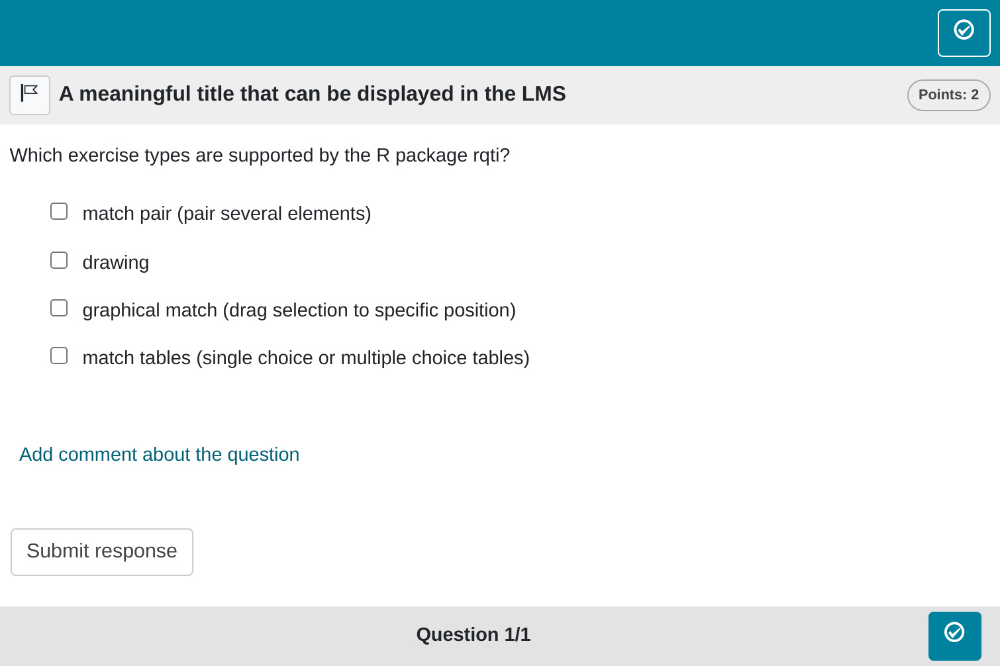

```{r, include = FALSE}
knitr::opts_chunk$set(
  collapse = TRUE,
  comment = "#>"
)
```

```{r setup, echo=FALSE}
library(rqti)
```

## Minimum version

This is just a normal multiple choice exercise. A template is automatically created when you initiate an rqti project through RStudio. Alternatively, it can be added by clicking on `New file -> R Markdown -> From Template`. The `rqti` templates start with `rqti:`. Here we look at the templates `rqti`: multiplechoice (simple)` and `rqti: multiplechoice (complex)`.

The minimum you need to provide is the `type: mpc` (or the equivalent `type: multiplechoice` or `type: mchoice`) in the yaml-section and a list with at least two elements in a section called **\# question**:

```{r comment='', echo = F}
cat(readLines(fs::path_package("rmarkdown/templates/multiplechoice-simple/skeleton",
                               "skeleton.Rmd",
                               package = "rqti")), sep = '\n')
```

Note that in this example, a feedback section was also provided. This is optional, but usually it is a good idea to give some explanation for students.

Further note that the `knit` parameter is set to the custom `rqti` knit function, which will handle the preview. Clicking the Knit button in RStudio produces the following in the viewer pane (or browser of your choice):

{width=100%}

You can also use the opal (set it up before, see: [API Opal](api_opal.html)) render function (`knit: rqti::render_opal`), which should produce the following:

{width=100%}

Multiple choice exercises are essentially the same as single choice exercises, except that none or several choices can be correct. The correct choices are specified by surrounding them with asterisks (markdown for italic). If you need to use italic in your choices, surround the whole question with the `<i> </i>` tag, instead. Note that the default points are $0.5n$, where $n$ is the number of choices. Here we have 4 choices, so 2 points can be reached. For a correct choice 0.5 points are gained, for an incorrect 0.5 are deducted. The minimum number of points is 0 in any case. 

Among various grading options, we find this to be the most intuitive, especially when considering the element of guessing. Given our inclination against forced-choice exercises, we do not see significant value in introducing different grading alternatives. Rather, we recommend directing attention towards better exercise types like gaps for a more effective assessment approach. See also the section [Some advice on multiple choice exercises].

## More control

If you want to have more fine-grained control, consider the available attributes for the yaml section in the RMD template `rqti`:multiple-choice (complex)`.

```{r comment='', echo = F}
cat(readLines(fs::path_package("rmarkdown/templates/multiplechoice-complex/skeleton/", "skeleton.Rmd", package = "rqti")), sep = '\n')
```

Which renders in Opal as:

{width=100%}

## yaml attributes

### type

Has to be `multiplechoice` or `mpc` or `mchoice` (compatible with `exams` package).

### identifier

This is the ID of the exercise, useful for later data analysis of results. The default is the file name. If you are doing extensive data analysis later on, it makes sense to specify a meaningful identifier. In all other cases, the file name should be fine.

### title

Title of the exercise. Can be displayed to students depending on the learning management system settings. Default is the file name.

### shuffle

If `true`, randomizes the order of the choices. Defaults to `true`. Only in rare occasions it makes sense to have a strict order of choices (setting shuffle to `false`).

### orientation

Should the items be displayed in `vertical` or `horizontal` mode? Default is `vertical`.

<!-- TODO, is this really possible? or do we always use points instead? -->
<!-- ### solution -->

<!-- An alternative way to specify the correct solution is by giving the integer of the correct choice. Usually not needed and less intuitive than specifying the correct choices directly in the list of all choices (see above). -->

### points

How many points are given for the whole exercise. Default is the number of choices times 0.5. The points $p$ are divided by the number of choices $c$ and then distributed over all choices. A correct choice will get the student +$p/c$, an incorrect choice -$p/c$. Witout such a procedure, a student could always select all answers and get the maximum number of points. See also the section [Some advice on multiple choice exercises].

## Feedback

Feedback can be provided with the section

- **\# feedback** (general feedback, displayed every time, without conditions)
- **\# feedback+** (only provided if student reaches all points)
- **\# feedback-** (only provided if student does not reach all points)

## List of answers as a variable

For more complex exercises the list of answers is often just available as a variable. In this case you can use the helper function `mdlist` to convert the vector into a markdown list:

```{r results="plaintext", comment=""}
mdlist(c("dropdown list", "programming language evaluation", "numeric gap"), 
       solutions = c(1, 3))
```

## Some advice on multiple choice exercises

A multiple choice exercise can always be transformed to multiple single choice exercises with the choices true/false or yes/no. Thus, from a psychometric perspective both types suffer from the same problems. They should be avoided if possible. This is mainly because guessing can never be ruled out. Psychometric properties will usually be worse than for numeric or string gap exercises that are similar in content.

There are situations where forced choice exercises cannot be entirely avoided. For instance, presenting several statistical analyses and asking the student whether the result is statistically significant or not is a good exercise. Still, this exercise should not be a multiple choice exercise because there are better alternatives: single choice, dropdowns or match tables. A multiple choice exercise can always be transformed into several single choices or dropdowns with the choices yes/no. For a long multiple choice list this is rather inconvenient but one could use a match table with the choices yes/no instead.

The advantage of these other exercise types is that the student has to make a selection. If the student does not have to make a selection he or she could get points even though the question was not even answered. Imagine a multiple choice exercise where all choices are incorrect. Without even attempting to solve this exercise, a student would get all points. If you use multiple choice exercises you have to balance out the yes/no responses. For single choices, dropdowns and match tables, this is not the case. So although we do support multiple choice exercises, we advise strongly against using them at all.
