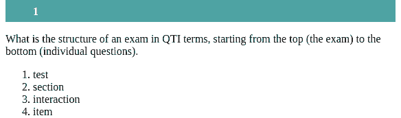

```{r, include = FALSE}
knitr::opts_chunk$set(
  collapse = TRUE,
  comment = "#>"
)
```

```{r setup, echo=FALSE}
library(qti)
```

## Minimum version

In this type of exercise, the candidate has to bring a list of items in the correct order. A template is available in RStudio when you click on `New file -> R Markdown -> From Template`. The qti templates start with `QTI:`. Here we look at the templates `QTI: order (simple)` and `QTI: order (complex)`.

The minimum you need to provide is the `type: order` in the yaml-section and a list with at least two elements in a section called **\#question**:

```{r comment='', echo = F}
cat(readLines(fs::path_package("rmarkdown/templates/order-simple/skeleton", "skeleton.Rmd", package = "qti")), sep = '\n')
```

Knitting via the Knit-Button to qtijs, this exercise renders as:



Alternatively, change the knit parameter to `knit: render_opal` (see [API Opal](opal_api)) to upload to Opal directly, producing:


The order of the items in the Rmd-list is considered to be the correct one.

Note that in this example, a feedback section was provided. The feedback is
optional, but usually it is a good idea to give some explanation for students.

## More control

If you want to have more fine-grained control, consider the Rmd template `QTI: order (complex)`, wich uses more yaml attributes.

```{r comment='', echo = F}
cat(readLines(fs::path_package("rmarkdown/templates/order-complex/skeleton", "skeleton.Rmd", package = "qti")), sep = '\n')
```

Which on Opal renders as:


## yaml attributes

### type

Has to be `order`.

### identifier

This is the id of the exercise, useful for later data analysis of results. The default is the file name. If you are doing extensive data analysis later on it makes sense to
specify a meaningful identifier. In all other cases, the file name should be
fine.

### title

Title of the exercise. Can be displayed to students depending on the learning management system settings. Default is the file name.

### points

How many points are given for the whole exercise. Default is $0.25*n$, where $n$ is the length of the list.

### points_per_answer

Defines the scoring method. If `TRUE` each selected answer will be scored individually (according to absolute position of the element in the list), if `FALSE` the whole task will be scored and a single mistake leads to 0 points. Default is `TRUE`.

## Feedback

Feedback can be provided with the section

-   **\# feedback** (general feedback, displayed every time, without conditions)
-   **\# feedback+** (only provided if student reaches all points)
-   **\# feedback-** (only provided if student does not reach all points)

## helpers

For more complex exercises the list of answers is sometimes available as a variable. In this case you can use the helper function `mdlist` to convert the vector into a markdown list:

```{r results="plaintext", comment=""}
order_list <- mdlist(c("Test", "Section", "Item", "Interaction"))
cat(order_list)
```

## Some advice on order exercises 

Usually, order exercises are focusing on an aspect of knowledge that is not particularly important. Knowing steps of procedures by heart is often not useful. Even professionals will have a checklist or a cheatsheet for these cases. Furthermore, grading of order exercises can be complicated because the absolute position of an item is less important than the relative position.
