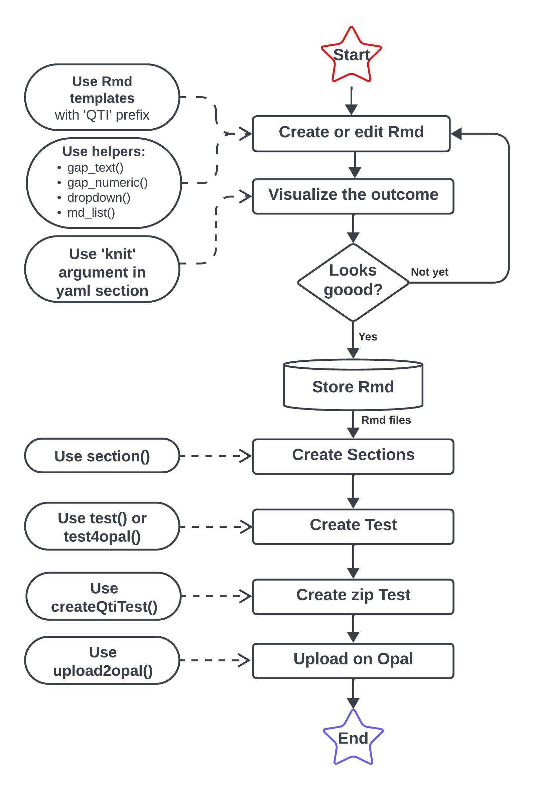

```{r, include = FALSE}
knitr::opts_chunk$set(
  collapse = TRUE,
  comment = "#>"
)
```

## Purpose of the qti package

Create qti exercises and tests/exams directly from R. Render them locally or to the learning management system Opal.

## Installation

The `qti` package is still in development. The only way to install it at the moment is from GitHub:

```{r eval=FALSE}
#install.pacakges("devtools") # install devtools if you do not have it yet
library(devtools)
install_github("shevandrin/qti")
```

<!-- `qti` have not published yet on CRAN. After publishing it will be possible to install package as follows: -->

<!-- ```{r eval=FALSE} -->
<!-- install.packages("qti") -->
<!-- ``` -->

After installation, load the package:

```{r }
library(qti)
```

Note that this will start a qtijs server, which will be used for previewing exercises. If you do not need this, turn it off with the environment variable: QTI_AUTOSTART_SERVER=FALSE (in your .Rprofile or in .Renviron).

## Quick start

Using RStudio, create a new Rmarkdown file, select **from Template** and choose one of the templates starting with **QTI: ...**. The *simple* ones include the minimum, the *complex* ones have more parameters. Click the Knit-Button and you should see a rendered exercise in the Viewer pane. The templates are self-explanatory, but more details about the exercise types can be found in the other articles:

- [Single choice](singlechoice.html)
- [Multiple choice](multiplechoice.html)
- [Essay](essay.html)
- [Gap](gap.html)
- [Dropdown](dropdown.html)
- [Order](html)
- [Directed pairs](directedpairs.html)
- [Tables](table.html)

To combine different exercises into a test, read: [Sections and Tests](section.html)

If you are using the learning management system Opal, please check out [Opal API](api_opal.html)

## General workflow

The basic workflow with the `qti` package can be described as follows:

1. Create exercise files.
    1. Create an Rmd document. You can start from scratch (specify `type` in the yaml section) or use Rmd templates starting with the prefix `QTI`.
    1. Write a section titled `# question` and create your interactions (gaps, choices, etc.). Use qti helper functions where needed.
    1. Set additional attributes in the yaml section. All types are explained in detail in the **Articles** menu on this website (top left).
    1. Choose a previewer: Either qtijs (`knit: qti::render_qtijs`), which will render your exercise locally or the learning management system Opal (`knit: qti::render_qtijs`). Note that using Opal requires you to set it up first: [Opal API](api_opal.html).
    1. Check if your task looks as desired. Modify until your are satisfied.
1. Create sections and tests based on your exercise files.
1. Write test (xml) to disk according to QTI standard and upload test file to your learning management system.
1. Download results data from your learning management system and read it in with the qti package for statistical analysis.

Each step includes certain `qti` functions, the most useful of them are shown in the following diagram:

{width=60%}

The best way to learn the workflow is to create a simple exercise, such as "Single Choice", as presented [in this article.](singlechoice.html)

Each exercise type is described in a separate article:

- [Single choice](singlechoice.html)
- [Multiple choice](multiplechoice.html)
- [Essay](essay.html)
- [Gap](gap.html)
- [Dropdown](dropdown.html)
- [Order](html)
- [Directed pairs](directedpairs.html)
- [Tables](table.html)

## Feedback and bug reports

Feel free to [let us know](mailto://shevandrin@gmail.com) which features your are missing or directly [open an issue on GitHub.](https://github.com/shevandrin/qti/issues) 
