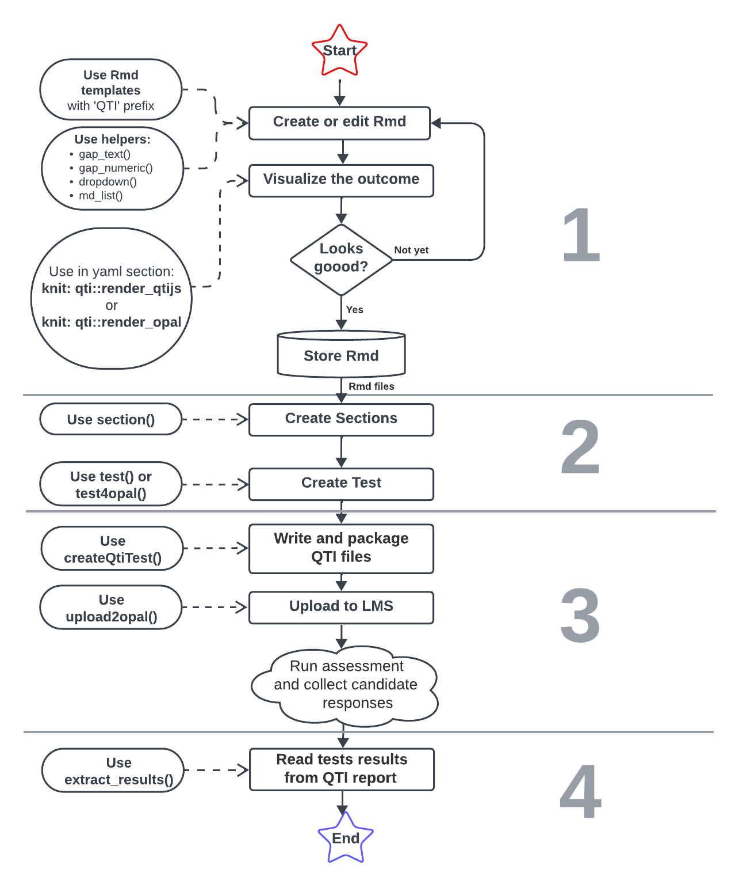

```{r, include = FALSE}
knitr::opts_chunk$set(
  collapse = TRUE,
  comment = "#>"
)
```

## Installation

The `qti` package is still under development. The only way to install it so far is installing from GitHub:

```{r eval=FALSE}
library(devtools)
install_github("shevandrin/qti")
```

`qti` have not published yet on CRAN. After publishing it will be possible to install package as follows:

```{r eval=FALSE}
install.packages("qti")
```

After installation the package has to be called:

```{r }
library(qti)
```

## Workflow

The basic workflow with `qti` can be presented in 4 main stages:

1. Create Exercise files.
    1. Create Rmd document. Use Rmd templates (starts with prefix `QTI:`).
    1. Write a section entitled `# question`. If necessary, include instances of the `r` code and use helper functions.
    1. Customize yaml section of Rmd document.
    1. Choose the way of visualization: QTIJS engine or LMS OPAL. Add `knit` attribute in yaml section.
    1. Check behavior and appearance of the task. Store the Rmd document in your repo.
1. Setup Test-object, where Exercises are organized in sections.
1. Generate Test-file according to QTI standard.
1. Upload assessment result file and get raw data for further analysis.

Each step includes certain `qti` functions, the most useful of them are shown in the following diagram:

{width=60%}

A more effective approach to learning the workflow is to create a simple exercise, such as "Single Choice", as presented [in this article.](singlechoice.html)

Full list of articles:

- [Single choice](singlechoice.html)
- [Multiple choice](multiplechoice.html)
- [Essay](essay.html)
- [Gap](gap.html)
- [Dropdown](dropdown.html)
- [Order](html)
- [Directed pairs](directedpairs.html)
- [Tables](table.html)

## Bug report

Feel free to [let us know](mailto://shevandrin@gmail.com) if `QTI` goes wrong or just [open an issue on GitHub.](https://github.com/shevandrin/qti/issues) 
