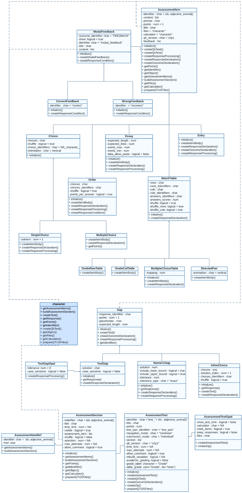

```{r, include = FALSE}
knitr::opts_chunk$set(
  collapse = TRUE,
  comment = "#>"
)
```

```{r, echo=FALSE}
library(qti)
```

<style>
  .zoomable-image {
    position: relative;
  }
  .zoomable-image img {
    width: 100%; /* Adjust the image size as needed */
    height: auto;
  }
  .zoomable-image img:hover {
    transform: scale(1.2); /* Adjust the zoom level as needed */
    transition: transform 0.3s; /* Adjust the transition duration as needed */
  }
</style>


This section is still under construction and only relevant if you want to create exercises without relying on Rmd files. Under the hood, qti uses S4 OOP. This means that you can create all exercise types as objects, which gives you more flexibility and is much faster. If you are happy with Rmd, there is nothing wrong using it. If you want to go to the next level, consider creating exercise objects directly.

First, check out the overview of our classes:

<div class="zoomable-image">
  
</div>

`qti` class model consists of classes that represent types of tasks (`SingleChoice`, `MultipleChoice`, `Essay`, `Entry`, `Order`, `DirectedPair`, `MultipleChoiceTable`, `OneInRowTable`, `OneInColTable`), elements of interactive content of tasks (`ModalFeedback`, `CorrectFeedback`, `WrongFeedback`, `TextGap`, `NumericGap`, `InlineChoice`, `TextGapOpal`), tests and their sections (`AssessmentSection`, `AssessmentTest`, `AssessmentTestOpal`).

## How to create task objects

There are two ways to create task objects:

1. a call to `new`
2. using constructor functions (**will be delivered soon**)

## Examples of creating task objects
```{r, echo=T, eval=F}
library(qti)
# simple examples
sc0 <- new("SingleChoice",
           identifier = "sc0",
           choices = c("answer1", "answer2", "answer3"))
ord0 <- new("Order",
            identifier = "ord0",
            choices = c("item1", "item2", "item3"))
# more advance example
sc1 <- new("SingleChoice",
          choices = c("option 1", "option 2", "option 3", "option 4"),
          title = "Single Choice Task",
          content = list("Pick up the right option"),
          points = 2,
          identifier = "sc_v0",
          feedback = c(new("WrongFeedback", title = "Error",
                                       content = list("You made a mistake")),
                          new("CorrectFeedback", title = "Success",
                                          content = list("Well done")),
                          new("ModalFeedback", title = "Common information",
                              content = list("Model answer of some details"))))
```
To see full list of slots call `?SingleChoice`

## Examples of creating section object

```{r, echo=T, eval=F}
# simple example
section0 <- new("AssessmentSection",
               identifier = "sect0",
               assessment_item = list(ord0))
# more advance example
section1 <- new("AssessmentSection",
               identifier = "sect1",
               title = "First Section",
               time_limits = 20,
               visible = FALSE,
               assessment_item = list(sc0, sc1),
               max_attempts = 2,
               allow_comment = TRUE)
```

## Examples of creating test object
```{r, echo=T, eval=F}
# simple example with a call to `new`
test0 <- new("AssessmentTest",
               identifier = "test",
               section= list(section0, section1))
# simple example using constructor `test()`
test0 <- test(c(section0, section1), "test")
# more advance example with a call to `new`
test1 <- new("AssessmentTest",
             identifier = "test",
             title = "Test",
             navigation_mode = "linear",
             section= list(section0, section1),
             time_limits = 60,
             max_attempts = 1,
             allow_comment = TRUE)
# more advance example using constructor `test()`
test1 <- test(content = c(section0, section1),
              identifier = "test",
              title = "Test", 
              navigation_mode = "linear", 
              time_limits = 60, 
              max_attempts = 1, 
              allow_comment = TRUE)
```
