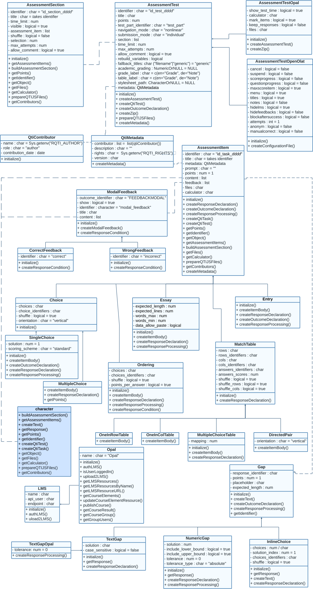

```{r, include = FALSE}
knitr::opts_chunk$set(
  collapse = TRUE,
  comment = "#>"
)
```

```{r, echo=FALSE}
library(rqti)
```

<style>
  .zoomable-image {
    position: relative;
  }
  .zoomable-image img {
    width: 100%; /* Adjust the image size as needed */
    height: auto;
  }
  .zoomable-image img:hover {
    transform: scale(1.2); /* Adjust the zoom level as needed */
    transition: transform 0.3s; /* Adjust the transition duration as needed */
  }
</style>

This section is still under construction and only relevant if you want to create exercises without relying on Rmd files. Under the hood, rqti uses S4 OOP. This means that you can create all exercise types as objects, which gives you more flexibility and is much faster. If you are happy with Rmd, there is nothing wrong using it. If you want to go to the next level, consider creating exercise objects directly. In the future we want to add simple constructor functions instead of relying on the `new` function, so that the OOP system is more accessible. Currently, the focus is still on the RMD interface.

First, check out the overview of our classes:

<div class="zoomable-image">
  
</div>

The `rqti` class model consists of classes that represent types of tasks:

- `?SingleChoice`
- `?MultipleChoice`
- `?Essay`
- `?Entry`
- `?Ordering`
- `?DirectedPair`
- `?MultipleChoiceTable`
- `?OneInRowTable`
- `?OneInColTable`


In addition there are classes for the elements of interactive content of tasks:

- `?TextGap`
- `?NumericGap`
- `?InlineChoice`
- `?TextGapOpal`
- `?ModalFeedback`
- `?CorrectFeedback`
- `?WrongFeedback`


Finally, there are classes for tests and their sections:

- `?AssessmentSection`
- `?AssessmentTest`
- `?AssessmentTestOpal`

## How to create task objects

There are two ways to create task objects:

1. A call to `new`.
2. Using constructor functions:
Constructor functions are available for creating various types of task-related objects, organized into the following categories:

Task Types. These functions create classes representing different types of tasks:
    
- `?singleChoice`
- `?multipleChoice`
- `?essay`
- `?entry`
- `?ordering`
- `?directedPair`
- `?multipleChoiceTable`
- `?OneInRowTable`
- `?oneInColTable`
        
Interactive Content. These functions create classes representing interactive elements within tasks:
    
- `?textGap`
- `?numericGap`
- `?textGapOpal`
- `?modalFeedback`
- `?correctFeedback`
- `?wrongFeedback`
        
Tests and Sections. These functions create classes representing tests and their organizational sections:
    
- `?assessmentSection`
- `?assessmentTest`
- `?assessmentTestOpal`

## Examples of creating task objects

```{r, echo=T, eval=F}
library(rqti)
# simple examples
sc0 <- new("SingleChoice",
           identifier = "sc0",
           choices = c("answer1", "answer2", "answer3"))
ord0 <- new("Ordering",
            identifier = "ord0",
            choices = c("item1", "item2", "item3"))
# more advance example
sc1 <- new("SingleChoice",
          choices = c("option 1", "option 2", "option 3", "option 4"),
          title = "Single Choice Task",
          content = list("Select the correct choice."),
          points = 2,
          identifier = "sc_v0",
          feedback = c(new("WrongFeedback", title = "Error",
                           content = list("You made a mistake")),
                       new("CorrectFeedback", title = "Success",
                           content = list("Well done")),
                       new("ModalFeedback", title = "Common information",
                           content = list("Model answer of some details"))))
```

To see the full list of slots call `?SingleChoice`

## Examples of creating section objects

```{r, echo=T, eval=F}
# simple example
section0 <- new("AssessmentSection",
                identifier = "sect0",
                assessment_item = list(ord0))
# note that assessment_item expects a list!
# more advance example
section1 <- new("AssessmentSection",
                identifier = "sect1",
                title = "First Section",
                time_limit = 20,
                visible = FALSE,
                assessment_item = list(sc0, sc1),
                max_attempts = 2,
                allow_comment = TRUE)
```

## Examples of creating test objects

```{r, echo=T, eval=F}
# simple example with a call to `new`
test0 <- new("AssessmentTest",
               identifier = "test",
               section = list(section0, section1))
# simple example using constructor `test()`
test0 <- test(c(section0, section1), "test")
# more advance example with a call to `new`
test1 <- new("AssessmentTest",
             identifier = "test",
             title = "Test",
             navigation_mode = "linear",
             section = list(section0, section1),
             time_limit = 60,
             max_attempts = 1,
             allow_comment = TRUE)
# more advance example using constructor `test()`
test1 <- test(content = c(section0, section1),
              identifier = "test",
              title = "Test", 
              navigation_mode = "linear", 
              time_limit = 60, 
              max_attempts = 1, 
              allow_comment = TRUE)
```
