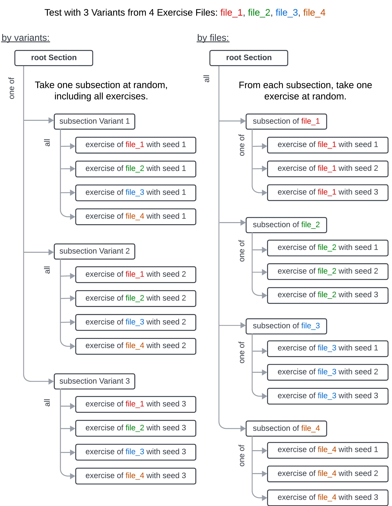

```{r setup secs, include = FALSE}
knitr::opts_chunk$set(
  collapse = TRUE,
  comment = "#>",
  cache = T
)
source("helper.R")
```

```{r setup2 secs, echo=FALSE}
library(rqti)
```

`r if(knitr::is_latex_output()) "# Sections and Tests"`

Creating single tasks is not particularly useful as one usually wants to combine different tasks into a test. A test in the QTI standard typically consists of one or more sections. Each Section can contain a combination of tasks or other subsections, providing great flexibility in test structure. Sections can be customized with respect to various parameters, such as time limit and shuffling.

The `rqti` package makes it very simple to mix different sources of task files:

- **Rmd (md) files**: You can use Rmarkdown files that are consistent with the `rqti` package (the `exams` package will not work, but see below)
- **QTI XML files**: These files should be valid regarding the QTI standard. To use your Rmd-files from the `exams` package you can convert them to xml first.
- **Objects of S4 `rqti` classes**: You can also use objects from the `rqti` package directly. See article \ref{rqti-oop-model}[rqti OOP model](rqti_oop_model.html).

##  Using the `section` and `test` functions

Although it is possible to feed a test with tasks directly, we suggest to always use a section, as this provides more flexibility and avoids several problems. Even if you do not need a section, you can just create a root section and put the tasks there.

We designed a simple wrapper for sections. Here we load some files from our package and use the function `section` to create the section. Note that we request 10 different variants of all tasks.

```{r ghost, include=FALSE}
path <- fs::path_package("exercises", package = "rqti")
files <- paste0(path, "/", c("gap1.Rmd", "gap2.Rmd"))
```

```{r section1, eval=F}
path <- fs::path_package("exercises", package = "rqti")
files <- paste0(path, "/", c("gap1.Rmd", "gap2.Rmd"))
root_section <- section(content = files, n_variants = 10)
```

Now we can make a test out of this and upload it to OPAL. Again there are helpers for that: `test` and `test4opal`. `test` is more general and is always consistent with the QTI model, whereas `test4opal` can use additional OPAL-specific parameters that are not necessarily consistent with QTI.

```{r section1upload, eval = F}
test <- test(root_section, "test1")
# createQtiTest is a method of the OOP class `test`
createQtiTest(test, zip_only = T)
repo <- upload2opal("test1.zip", open_in_browser = F)
```

```{r url, include=FALSE, eval=F}
url <- get_resource_url("test1")
url2 <- get_resource_url("test2")
```

Note that you could also call `upload2opal(test)` directly. We just wanted to demonstrate how to write out a test locally before uploading it somewhere. Of course you can also just use `render_qtijs(test)` to preview the test locally--- but in qtijs you will not see the structure of the test, so we use OPAL for demonstration purposes.

We now have 10 variants of the test, two of which are`r ltx(" displayed in Figures \\ref{a1} and \\ref{b1}.", ":")`

{width=100%}

{width=100%}

After the root section you can see the section exam_8833 (image 1) and exam_S7829 (image 2). There are actually 8 more (10 in total) and if you restart the exam, you will get one randomly assigned. You can try it yourself: https://bildungsportal.sachsen.de/opal/auth/RepositoryEntry/46081048578

To summarize so far: You can just pass your task files to the `content` parameter in `section` and define how many variants you would like to create of each file.

Of course, creating several variants only makes sense for random tasks. Single choice and multiple choice tasks could be part of different sections:

```{r section2, eval=F}
non_random_tasks <- paste0(path, "/", c("sc1.Rmd", "mpc1.Rmd"))
root_section <- list(section(files, n_variants = 10),
                     section(non_random_tasks))
```

Note that we use a list here for the root section. This is important as the `test` functions expect a list to be more flexible with different inputs (e.g. objects instead of files). Now we can again make a test out of this and upload it to OPAL:

```{r section2upload, eval = F}
test <- test4opal(root_section, "test2")
createQtiTest(test, zip_only = T)
repo <- upload2opal("test2.zip", "test2", open_in_browser = F)
```

In OPAL this will create the`r ltx(" structure displayed in Figures \\ref{a2} and \\ref{b2}.", " following structure:")`

{width=100%}

{width=100%}

As you can see, we still have our variable section with different variants (you see two of them in the screenshots). But now, we also have a fixed section that is the same for all tests. Try it out yourself: https://bildungsportal.sachsen.de/opal/auth/RepositoryEntry/46075805699

Note that the function `section` returns an `AssessmentSection` rqti-object:

```{r warning=FALSE, include=FALSE}
root_section <- list(section(essay()), section(essay()))
```

```{r class}
lapply(root_section, class)
```

The entire rqti-package relies on S4 Object-Oriented Programming (OOP), where tasks, sections, and tests are treated as distinct objects. If you are not accustomed to OOP, it might seem unfamiliar at first, but you do not need to delve into all the technical details to use it effectively. Simply utilize the provided helper functions, and you should navigate through with ease.

To customize your sections and tests, check out the references: `?section` and `?test` or `?test4opal`.

<!-- If you happen to know OOP and want to take advantage of your skills, you can also create sections and tests directly with our OOP functions. -->

<!-- ## Create sections with OOP -->

<!-- ```{r} -->

<!-- ``` -->

## Two approaches for parallel versions of a task

By default the `section` function creates different variants of a task by drawing different seeds and creating subsections with these seeds. There is also a different approach to introduce randomness. Have a look at `r ltx("Figure \\ref{scheme}.", "the following schema:")`

{width=100%}

On the left-hand side, three distinct subsections were generated, each housing the same task files but with **different variants**. A participant, starting at the root section, is randomly assigned to one of these subsections, encountering all tasks within that specific subsection. This setup is generally satisfactory for most instructors conducting exams. It ensures that all participants within a subsection encounter the same set of tasks, facilitating psychometric analysis. However, a drawback is the potential for forbidden collaboration between participants within the same subsection.

On the right-hand side, an alternative strategy was implemented. Each task **file** now has its dedicated subsection, encompassing its diverse variants. Participants navigate through each section, being assigned only one variant of the task per section. The noteworthy distinction from the other approach lies in the plethora of potential paths available in the test. Given the presence of 3 variants for each of the 4 files, a total of $3^4 = 81$ paths emerges. While this configuration may complicate psychometric analysis and introduce challenges in maintaining task difficulty equilibrium, it provides a notable advantage in thwarting cheating, as the paths of two students are likely to differ.

However, exercising caution is imperative when adopting this approach, particularly in an exam setting. Interestingly, this setup finds greater utility when exchanging specific tasks among instructors. For instance, generating 20 variants of a task and bundling them into a test allows for easy import as a subtest in other instructors' exams. Notably, such flexibility would not be feasible with the structure on the left-hand side.

To choose between these two versions you can use the parameter `by` in the sense of `section` by `variants` or `section` by `files`.

```{r illustr, eval=FALSE}
root_section = section(content = files, n_variants = 3, by = "files")
```

1. For "by variants" (left scheme on the picture) use `by = "variants"`
1. For "by files" (right scheme) use `by = "files"`

We are still looking for better semantics of these cases, so if you have a good idea, open an issue on our github page: <https://github.com/shevandrin/rqti>
