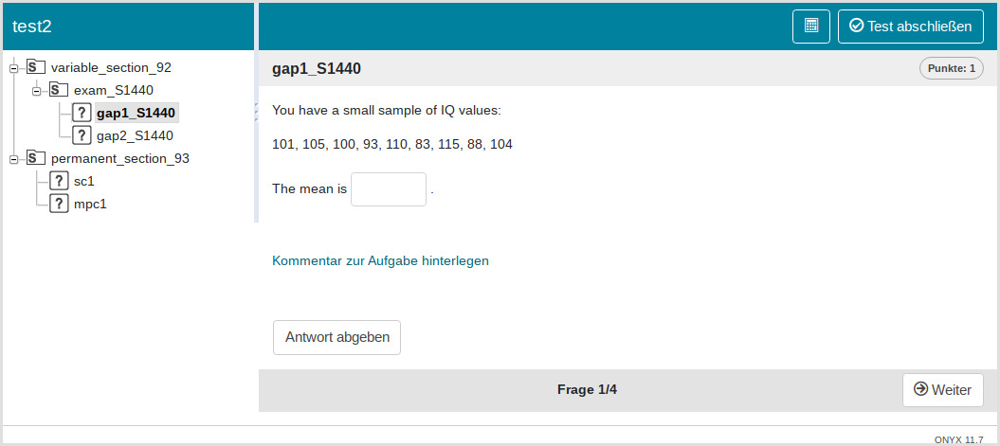

```{r setuppre, include = FALSE}
knitr::opts_chunk$set(
  collapse = TRUE,
  comment = "#>",
  cache = T
)
```

```{r setup, echo=FALSE}
library(qti)
```

Creating single exercises is not particularly useful as one usually wants to combine different exercises into a test. A test in the QTI standard typically consists of one or more sections. Each Section can contain a combination of exercises or other subsections, providing great flexibility in test structure. Sections can be customized with respect to various parameters, such as time limit and shuffling.

The `qti` package makes it very simple to mix different sources of exercise files:

- **Rmd (md) files**: You can use Rmarkdown files that are consistent with the `qti` package (the `exams` package will not work)
- **QTI XML files**: These files should be valid regarding the QTI standard. To use your Rmd-files from the `exams` package you can convert them to xml first.
- **Objects of S4 `qti` classes**: You can also use objects from the `qti` package directly. See [QTI OOP model](qti_oop_model.html).

##  Using the `section` and `test` functions

Although it is possible to feed a test with exercises directly, we suggest to always use a section, as this provides more flexibility and avoids several problems. Even if you do not need a section, you can just create a root section and put the exercises there.

We designed a simple wrapper for sections. Here we load some files from our package and use the function `section` to create the section. Note that we request 10 different variants of all exercises.

```{r section1, eval=T}
path <- fs::path_package("exercises", package = "qti")
files <- paste0(path, "/", c("gap1.Rmd", "gap2.Rmd"))
root_section <- section(files = files, n_variants = 10)
```

Now we can make a test out of this and upload it to Opal. Again there are helpers for that: `test` and `test4opal`. `test` is more general and is always consistent with the QTI model, whereas `test4opal` can use additional Opal-specific parameters that are not necessarily consistent with QTI.

```{r section1upload, eval = F}
test <- qti:::test(root_section, "test1")
# createQtiTest is a method of the OOP test class
createQtiTest(test, zip_only = T)
repo <- upload2opal("test1.zip", open_in_browser = F)
```

We now have 10 versions of the test, two of which look like this:


After the root section you can see the section exam_8833 (image 1) and exam_S7829 (image 2). There are actually 8 more (10 in total) and if you restart the exam, you will get one randomly assigned. You can try it yourself: `r get_resource_url("test1")`.

To summarize so far: You can just pass your exercise files to the `files` parameter in `section` and define how many variants you would like to create of each file.

Of course, creating several versions only makes sense for random exercises. Single choice and multiple choice exercises could be part of different sections:

```{r section2, eval=T}
non_random_exercises <- paste0(path, "/", c("sc1.Rmd", "mpc1.Rmd"))
root_section = list(section(files, n_variants = 10), 
                    section(non_random_exercises))
```

Note that we use a list here. Now we can again make a test out of this and upload it to Opal:

```{r section2upload, eval = F}
test <- qti:::test4opal(root_section, "test2")
createQtiTest(test, zip_only = T)
repo <- upload2opal("test2.zip", open_in_browser = F)
```

In Opal this will create the following structure:




As you can see, we still have our variable section with different variants (you see two of them in the images). But now, we also have a fixed section that is the same for all tests.

Note that the function `section` returns an `AssessmentSection` qti-object:

```{r class}
lapply(root_section, class)
```

Indeed, the whole qti-package is based on S4 OOP, so exercises, sections and tests are all objects. If you have no experience with OOP, this might feel a little bit unfamiliar, but to use it, you do not need to know all details. Just use the helper functions and you should be fine.

To customize your sections and tests, check out the references: [section](reference/section.html) and [test](reference/test.html) or [test4opal](reference/test4opal.html)

<!-- If you happen to know OOP and want to take advantage of your skills, you can also create sections and tests directly with our OOP functions. -->

<!-- ## Create sections with OOP -->

<!-- ```{r} -->

<!-- ``` -->

## Two approaches for different variants of a single exercise

By default the `section` function creates different variants of an exercise by drawing different seeds and creating subsections with these seeds. There is also a different approach to introduce randomness. Check out the following figure:

{width=80%}

On the left-hand side four different subsections with the same exercise files (but different variants of them) were created. A single participant, starting at the root section, will be randomly assigned to only one subsection. He or she will then be presented all exercises from this subsection. This is the default and most instructors will be happy with this setup for their exams. Basically, this is a common experimental design. All participants in one subsection see the same exercises, which is also useful for psychometric analysis. The disadvantage is that if two students know they are in the same subsection, they could help each other.

On the right-hand side for each exercise file a subsection was created, containing the different versions of the exercise. Each participant goes through each section, but will only be assigned a single version from the section. The obvious difference to the first approach is that there are many paths through such a test. Indeed, with 3 versions and 4 files, there are $3^4 = 81$ paths. This is not particularly useful for psychometric analysis and could lead to other problems. For instance, if you did not carefully construct your exercises, they might differ substantially in difficulty between different versions. With 81 possible paths, there might be some that are particularly difficult and others that are fairly easy. You will have no way to know, which is which because each path will only have few participants. The advantage of this setup is that cheating becomes more difficult because the paths of two students will likely differ. Still, we advise to only use this approach if you know what you are doing, especially for exams.


1. For "by variant" (left scheme on the picture) use `by_variant = TRUE`
1. For "by files" (right scheme) use `by_files = TRUE`

```{r illustr, eval=FALSE}
root_section = section(files = files, n_variants = 3, by_files = TRUE)
```
