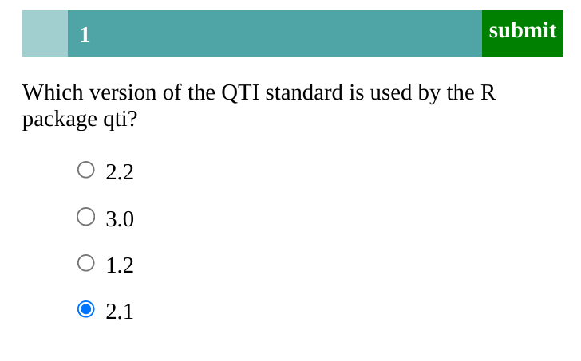

<!-- todo: wait until BPS replies, then we can take screenshots with the approach below -->

```{r, include = FALSE}
knitr::opts_chunk$set(
  collapse = TRUE,
  comment = "#>"
)
```

```{r setup, echo = F}
library(qti)
```

## Minimum version

The simplest exercise type in the qti package is single choice. The minimum you need to provide is the `type: sc` (or the equivalent `type: singlechoice`) in the yaml-section and a list with at least two elements in the section **\# question**:

```{r comment='', echo = F}
cat(readLines(fs::path_package("exercises", "sc1.Rmd", package = "qti")), sep = '\n')
```

<!-- Iframe does not seem to work out of the box -->

<!-- <iframe src="http://127.0.0.1:4321" sandbox="allow-scripts"></iframe> -->

Note that in this example, a feedback section was also provided. This is optional, but usually it is a good idea to provide some explanation for students (here not really, since it is trivial).

Calling `rmd2qti` on the file produces the xml-file in the current folder. In the QTI player ONYX this file renders as:

ADD: function rmd2opal...but leaves out important step for non-opal users

```{r eval=FALSE}
rmd2qti(fs::path_package("exercises", "sc1.Rmd", package = "qti"))
url <- upload2opal("sc1.xml") # you need an OPAL account for that!
```

```{r eval=FALSE}
system(paste0("wkhtmltoimage ", url, " sc1.png"))
```

```{r eval=FALSE}
# does not work, produces something strange
system(paste0("wkhtmltoimage ", "http://127.0.0.1:6052 ", "sc1.png"))
```

You can also just click the knit Button in RStudio, which will produce an html file. But this file is not the final product as it just translates the md to html. To see what the qti-file will look like, you can uncomment the line `#knit: qti::knit_qti_html` in the yaml section and click the knit Button again. This will start a local server and show you a preview via QTIJS. The same is achieved when you run `render_xml("sc1.xml")`. The file is rendered as:

{width="400"}

## Syntax explained

Let us have a closer look at the input file.

```{r comment='', echo = F}
cat(readLines(fs::path_package("exercises", "sc1.Rmd", package = "qti")), sep = '\n')
```

Note that you do not necessarily need to specify which list element is correct. The first one is treated as the correct one, which is a nice shortcut. If you communicate this to your collaborators, it is also much easier to read. They do not need to look anywhere else in the file for checking the correct answer.

Of course you can specify the correct choice if need be. Our preferred way of doing this is by putting asterisks around this option:

```{r comment='', echo = F}
cat(readLines(fs::path_package("exercises", "sc1b.Rmd", package = "qti")), sep = '\n')
```

Which renders as:

```{r eval=FALSE}
rmd2qti(fs::path_package("exercises", "sc1b.Rmd", package = "qti"))
upload2opal("sc1b.xml") # hide
```

```{r eval=FALSE}
system(paste0("wkhtmltoimage ", url, "sc1b.png"))
```

Once again, this is much easier to read than providing the solution somewhere else (in the yaml section). Furthermore, producing a preview as html directly shows you which element is correct.

An important note: Do not forget to put a blank line before your question and the answer list, otherwise the list will not be a proper list:

```{verbatim}
A question text that is not separated by a blank line
- 1.2
- 2.1
- 3.0
- 2.2
```

Renders as:

> My question text, not separated by a blank line - 1.2 - 2.1 - 3.0 - 2.2

## More control

If you want to have more fine-grained control, consider the available attributes for the yaml section. In addition you can also set feedback for correct and incorrect responses.

```{r comment='', echo = F}
cat(readLines(fs::path_package("exercises", "sc1c.Rmd", package = "qti")), sep = '\n')
```

Which renders as:

```{r eval=FALSE}
rmd2qti(fs::path_package("exercises", "sc1c.Rmd", package = "qti"))
upload2opal("sc1c.xml") #hide?
```

```{r eval=FALSE}
system(paste0("wkhtmltoimage ", url, "sc1c.png"))
```

## yaml attributes

### type

Has to be `singlechoice` or `sc` (a shortcut for singlechoice) or `schoice` (compatible with `exams`package)

### identifier

This is the id of the exercise, useful for later data analysis of results. The default is the file name. If you are doing extensive data analysis later on it makes sense to specify a meaningful identifier. In all other cases, the file name should be fine.

### title

Title of the exercise. Can be displayed to students depending on the learning management system settings. Default is the file name.

### shuffle

If `true`, randomizes the order of the choices. Defaults to `true`. Only in rare occasions it makes sense to have a strict order of choices (setting shuffle to `false`.

### orientation

Should the items be displayed in `vertical` or `horizontal` mode? Default is vertical.

### solution

An alternative way to specify the correct solution by giving the integer of the correct choice. Usually not needed and less intuitive than specifying the correct choice directly in the list of all choices (see above).

### points

How many points are given for the correct solution. Default is 1. You cannot do much wrong giving 1 point for a single choice exercise.

## Feedback

Feedback can be provided with the section

-   **\# feedback** (general feedback, displayed every time, without conditions)
-   **\# feedback+** (only provided if student reaches all points)
-   **\# feedback-** (only provided if student does not reach all points)

## List of answers as a variable

For more complex exercises the list of answers is often just available as a variable. In this case you can use the helper function `answerlist` to convert the vector into a markdown list:

```{r results="plaintext", comment=""}
answerlist(c(1.2, 2.1, 2.2, 3.0), solutions = c(2))
```

<!-- make a separate vignette for this -->

<!-- ## A programatic low level approach -->

<!-- The `qti` package is very flexible in that you can also use low level functions to create qti content. Let us say you have a csv table with many single choice exercises. It is quite easy to transform this to a qti section: -->

<!-- ```{r} -->

<!-- ``` -->

## Some advice on single choice exercises

From a psychometric perspective single choice exercises are the worst option for ability assessment. This is mainly because guessing can never be ruled out. Psychometric properties will usually be worse than for gap exercises that are similar in content.

In the `exams` package you will see many examples where numeric gaps are transformed into single choice exercises. In our opinion this only makes sense if the learning management system does not support gap exercises, the support is poor or a print exam with automatic grading is a strict requirement. Otherwise, most exercises will be better with numeric (or string) gaps.

There are situations where single choice exercises cannot be avoided. For instance, exercises regarding the level of measurement only have five choices (nominal, ordinal, interval, ratio, absolute). In this case we recommend to ask several questions, not just one. Also you might want to give less points to single choice exercises in general to reduce the variance caused by guessing.

In summary, try to avoid single choice exercises. Specifically, do not transform numeric gap exercises to single choice exercises, unless you have a good reason. If you cannot avoid single choice exercises, ask several questions, not just one. Consider giving less weight to single choice exercises in grading.
