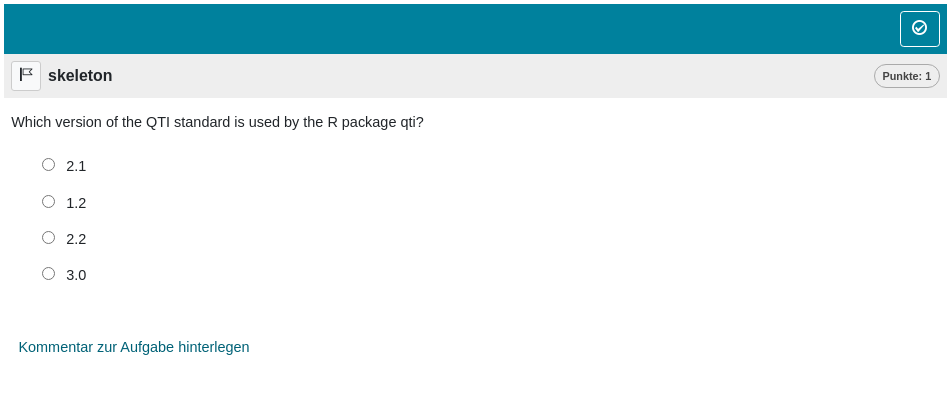
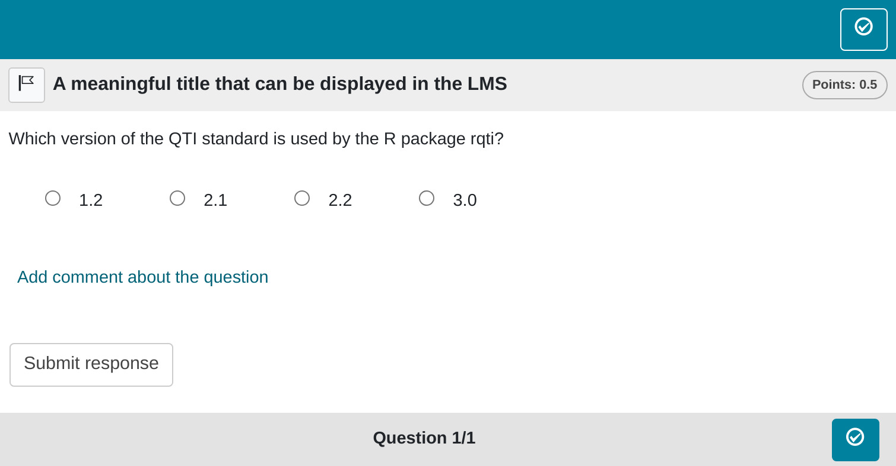

```{r, include = FALSE}
knitr::opts_chunk$set(
  collapse = TRUE,
  comment = "#>"
)
```

```{r setup, echo = F}
library(rqti)
```

Please be aware that this is the inaugural article in our package, and consequently, it may exhibit more verbosity than subsequent articles. We aim to highlight crucial points that might not be as explicitly addressed in other articles. Therefore, we suggest thoroughly reading through this article once before proceeding to the exercise types that pique your specific interest.

## Minimum version

The simplest exercise type in the rqti package is single choice. A template is automatically created when you initiate an rqti project through RStudio. Alternatively, it can be added by clicking on `New file -> R Markdown -> From Template`. The `rqti` templates start with `rqti:` Here we look at the templates `rqti: singlechoice (simple)` and `rqti: singlechoice (complex)`.

The minimum you need to provide is the `type: sc` (or the equivalent `type: singlechoice`, or `type: schoice`) in the yaml-section and a list with at least two elements in a section called **\# question**:

```{r comment='', echo = F}
cat(readLines(fs::path_package("rmarkdown/templates/singlechoice-simple/skeleton", "skeleton.Rmd", package = "rqti")), sep = '\n')
```

Note that in this example, a feedback section was also provided. This is optional, but usually it is a good idea to give some explanation for students.

Further note that the `knit` parameter is set to a custom `rqti` function, which will handle the preview. This is not necessarily required, but simplifies the workflow substantially. If you leave it out, the default preview is just an html file. If you add our knit function, you will get a more realistic preview.

To see what the final result might look like in a learning management system you can just click the `Knit` button in RStudio. This will produce an rqti xml file and render it in the viewer pane via QTIJS (you can also just fire up the displayed server url in the browser if you do not use RStudio).

{width=100%}

The corresponding xml file is created in the same folder as the Rmd file if you click the Knit-Button.
<!-- or in the current directory if you execute the functions from the console. Usually, the Knit button will be sufficient for most use cases, but if you need more control the functions `rmd2qti, render_xml, render_zip` are handy. The functions give a message about the path of the created file. -->

Many learning management systems can directly import a QTI-xml-file, so all you need to do is upload the generated file. Compositions of exercises are covered in the article: [sections and tests](section.html).

If you happen to use OPAL/ONYX, you can also upload your exercises with the knit parameter directly:

```{r eval=FALSE}
knit: render_opal
```

This will upload the file and open a browser with the opal url. It should look like this:

{width=100%}

Setting up OPAL requires some additional steps, which are covered in the article: [Setting up OPAL](api_opal.html).

By default the rights of the uploaded material in OPAL are set to public, so no authentication is required to view the material. Otherwise you have to login into OPAL, which will log you out in the API. Please take this into account when testing your material. Without changing the defaults anyone with the link has access to your exercise.

<!-- The function `render_opal` will aks you for credentials first. Depending on the OPAL setup you might need to use a VPN. Furthermore only password-based authentication accounts work (Shibboleth does not work). You probably need to consult your IT before using `upload2opal`. More information on this can be found in the article: OPAL API. Specifically, we describe how to setup the API at TU Chemnitz. -->

## Syntax explained

Let us have a closer look at the input file.

```{r comment='', echo = F}
cat(readLines(fs::path_package("rmarkdown/templates/singlechoice-simple/skeleton", "skeleton.Rmd", package = "rqti")), sep = '\n')
```

Note that you do not necessarily need to specify which list element is correct. The first one is treated as the correct one, which is a useful shortcut. If you communicate this to your collaborators, it is also much easier to read. They do not need to look anywhere else in the file for checking the correct answer.

Of course you can specify the correct choice if need be. Our preferred way of doing this is by putting asterisks around this option. For instance:

```{markdown}
Choose the correct one:
  
- A
- B
- *C* <!-- treated as correct -->
- D
```

Once again, this is much easier to read than providing the solution somewhere else (e.g. in the yaml section). Furthermore, producing a preview as html directly shows you which element is correct.^[If you want to use italics in your choice, you can also wrap the correct solution in emphasize tags `<em> a choice with *some italics*</em>`]

An important note: Do not forget to put a blank line before your question and the answer list, otherwise the list will not be a proper list:

```{verbatim}
A question text that is not separated by a blank line
- A
- B
- C
- D
```

Renders as:

> A question text that is not separated by a blank line - A - B - C - D

## More control

If you want to have more fine-grained control, consider the RMD template `rqti: singlechoice-complex`, which uses more yaml attributes. In addition you can also set feedback for correct and incorrect responses.

```{r comment='', echo = F}
cat(readLines(fs::path_package("rmarkdown/templates/singlechoice-complex/skeleton", "skeleton.Rmd", package = "rqti")), sep = '\n')
```

Which renders in OPAL as:

{width=100%}

Let us now discuss all yaml attributes that can be used

## yaml attributes

### type

Has to be `singlechoice` or `sc` (a shortcut for singlechoice) or `schoice` (compatible with `exams` package)

### identifier

This is the ID of the exercise, useful for later data analysis of results. The default is the file name. If you are doing extensive data analysis later on, it makes sense to specify a meaningful identifier. In all other cases, the file name should be fine.

### title

Title of the exercise. Can be displayed to students depending on the learning management system settings. Default is the file name.

### shuffle

If `true` (the default), randomizes the order of the choices. Only in rare occasions it makes sense to have a strict order of choices (setting shuffle to `false`).

### orientation

Should the items be displayed in `vertical` or `horizontal` mode? Default is `vertical`.
<!-- ### solution -->

<!-- An alternative way to specify the correct solution by giving the integer of the correct choice. Usually not needed and less intuitive than specifying the correct choice directly in the list of all choices (see above). Note that specifying `solution` will override the manual selection with asterisks. -->

### points

How many points are given for the correct solution. Default is 1.

## Feedback

Feedback can be provided with the section

-   **\# feedback** (general feedback, displayed every time, without conditions)
-   **\# feedback+** (only provided if student reaches all points)
-   **\# feedback-** (only provided if student does not reach all points)

We typically prefer providing comprehensive feedback rather than conditional feedback. Basically, we never use feedback+ and feedback-. It is often more effective to present the entire solution, organized into manageable chunks that users can expand or collapse, such as HTML elements with `<details>` and `<summary>` tags.

## List of answers as a variable

For more complex exercises the list of answers is often just available as a variable. In this case you can use the helper function `mdlist` to convert the vector into a markdown list:

```{r results="plaintext", comment=""}
mdlist(c(1.2, 2.1, 2.2, 3.0), solutions = 2)
```

<!-- make a separate vignette for this -->

<!-- ## A programatic low level approach -->

<!-- The `rqti` package is very flexible in that you can also use low level functions to create rqti content. Let us say you have a csv table with many single choice exercises. It is quite easy to transform this to a rqti section: -->

## Some advice on single choice exercises

From a psychometric perspective single choice exercises are the worst option for ability assessment. This is mainly because guessing can never be ruled out. Psychometric properties will usually be worse than for gap exercises that are similar in content.

In an alternative R package designed for test creation, namely `exams`, numerous instances demonstrate the transformation of numeric gaps into single-choice exercises. In our perspective, this approach is justified only in scenarios where the learning management system lacks support for gap exercises, exhibits poor support, or demands a print exam with automated grading. In all other cases, opting for numeric (or string) gaps would generally yield more effective exercises.

Certain situations necessitate the use of single-choice exercises. For example, when addressing the level of measurement, there are only five options (nominal, ordinal, interval, ratio, absolute). In such cases, we advise posing multiple questions instead of a single one. Additionally, it could be beneficial to assign fewer points to single-choice exercises overall to mitigate the impact of guessing and minimize variance.

If you have several single choice exercises where the answer options stay the same, consider using a match table instead: [Match Tables](table.html)

In conclusion, it is advisable to steer clear of single-choice exercises whenever possible. Specifically, refrain from converting numeric gap exercises into single-choice format unless there is a compelling reason to do so. If the use of single-choice exercises is unavoidable, opt for posing multiple questions, perhaps utilizing a match table. Additionally, contemplating a reduced weight for single-choice exercises in grading can contribute to a more balanced assessment.
