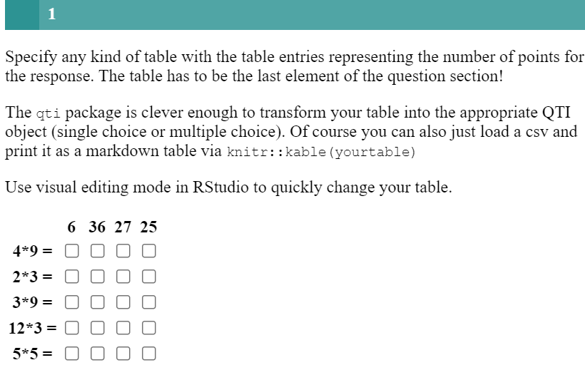
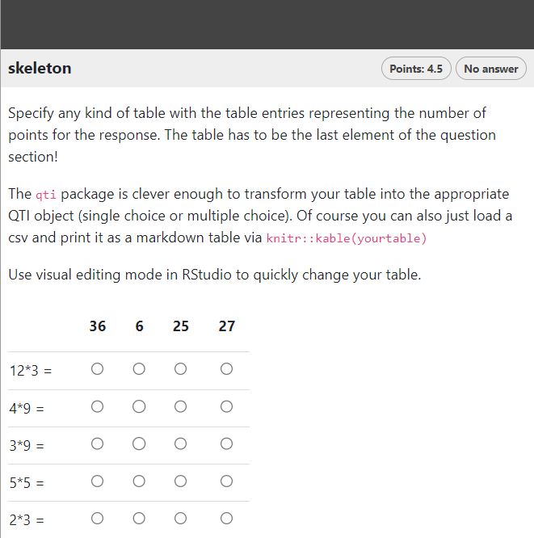

```{r, include = FALSE}
knitr::opts_chunk$set(
  collapse = TRUE,
  comment = "#>"
)
```

```{r setup, echo=FALSE}
library(qti)
```

## Minimum version

In this type of exercise, the candidate is given a table in which he is required to match elements from rows and columns. A template is available in RStudio when you click on `New file -> R Markdown -> From Template`. The qti templates start with `QTI:`. Here we look at the templates `QTI: table (simple)` and `QTI: table (complex)`.

The minimum you need to provide is the `type: table` in the yaml-section and a list with at least two elements in a section called **\#question**:

```{r comment='', echo = F}
cat(readLines(fs::path_package("rmarkdown/templates/table-simple/skeleton", "skeleton.Rmd", package = "qti")), sep = '\n')
```

The table entries contains the number of points for the response. Any figure above 0 is considered as a right answer. How many correct answers there can be in any row or column is up to the creator. The overall points for the exercise is calculated a sum of the positive table entries.

Of course you can also just load a csv and print it as a markdown table via `knitr::kable(yourtable)`. The table has to be the last element of the question section!

Note that in this example, a feedback section was also provided. The feedback is
optional, but usually it is a good idea to give some explanation for students.

Further note that the `knit` parameter is set to the custom qti knit function,
which will handle the preview. Clicking the Knit button in RStudio produces the
following in the viewer pane (or browser of your choice):

{width="400"}

## More control

If you want to have more fine-grained control, consider the RMD template `QTI: table (complex)`, wich uses more yaml attributes.

```{r comment='', echo = F}
cat(readLines(fs::path_package("rmarkdown/templates/table-complex/skeleton", "skeleton.Rmd", package = "qti")), sep = '\n')
```

Which renders as:

{width="400"}

# yaml attributes

### type

Has to be `table` or `match`.

### identifier

This is the id of the exercise, useful for later data analysis of results. The default is the file name. If you are doing extensive data analysis later on it makes sense to
specify a meaningful identifier. In all other cases, the file name should be
fine.

### title

Title of the exercise. Can be displayed to students depending on
the learning management system settings. Default is the file name.

### shuffle

It mixes the order of rows and columns in the table. Default is `TRUE`.

### rows_shuffle

It mixes only the row order, while the column order is preserved by default. Default is `TRUE`.

### cols_shuffle

It mixes only the column order, while the row order is preserved by default. Default is `TRUE`.

### abbr_id

Defines the use of an abbreviation as a way to generate row and column identifiers. See more about rows and colums identifiers [here](#ids).

## Feedback

Feedback can be provided with the section

-   **\# feedback** (general feedback, displayed every time, without conditions)
-   **\# feedback+** (only provided if student reaches all points)
-   **\# feedback-** (only provided if student does not reach all points)

## Managing identifiers {#ids}

The identifiers of rows and columns are useful for later data analysis of results. If you are doing extensive data analysis later on, it makes sense to specify meaningful identifiers, or at least make them more recognizable.

There 3 ways to form identifiers of rows and columns:

1. By default `qti` makes them like `row_1`...`row_N`, `col_1`...`col_N`.
2. Using `abbr_id: true` in the yaml section of the Rmd file, `qti` takes the first word of a row or column element and associates it with the abbreviation of the remaining text of the element. Example: for element "Mean Value Theorem for Integrals" `qti` makes id as "Mean_VTfI".
3. If you are interested in further in-depth analysis, you will probably want to assign your own values as identifiers.  In this case, in the markdown table or csv file you need to put:
- a column with a predefined header 'rowid' with values for row identifiers.
- a row with a predefined 'colid' header with values for columns identifies.


## Some advice on essay exercises 

TODO
