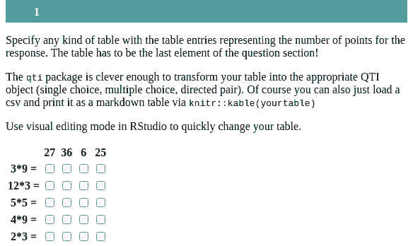
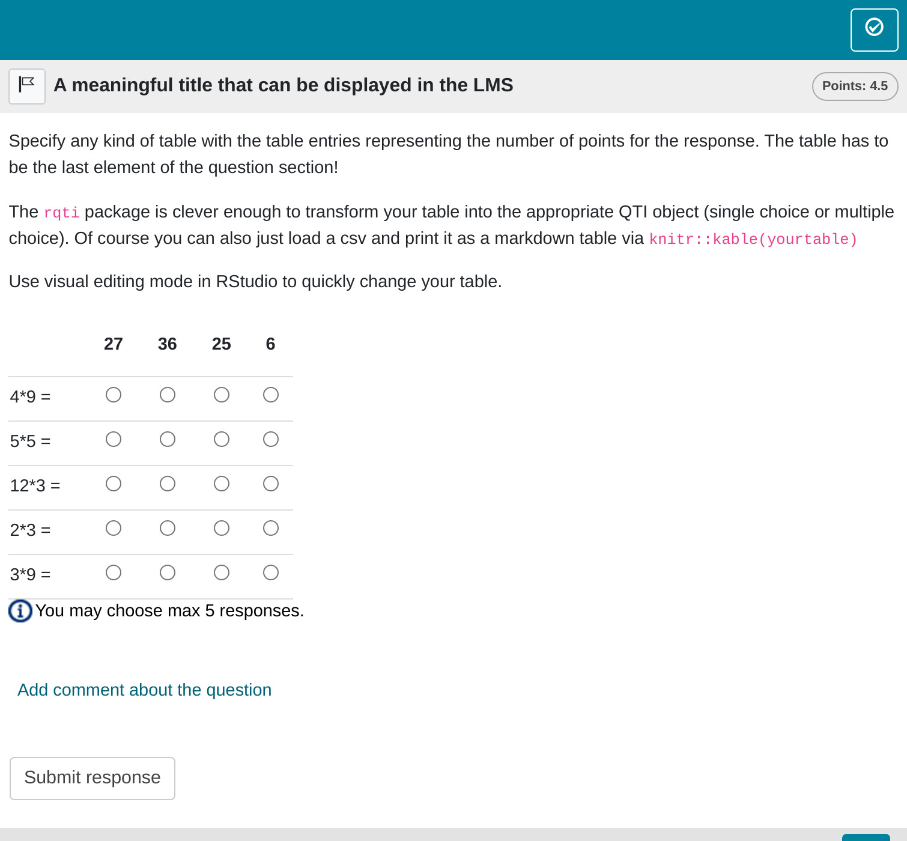
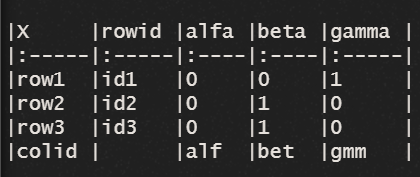

```{r, include = FALSE}
knitr::opts_chunk$set(
  collapse = TRUE,
  comment = "#>"
)
```

```{r setup, echo=FALSE}
library(qti)
```

## Minimum version

In this type of exercise, the candidate must match rows and columns of a table. A template is available in RStudio when you click on `New file -> R Markdown -> From Template`. The qti templates start with `QTI:`. Here we look at the templates `QTI: table (simple)` and `QTI: table (complex)`.

The minimum you need to provide is the `type: table` in the yaml-section and a table in a section called **\#question**:

```{r comment='', echo = F}
cat(readLines(fs::path_package("rmarkdown/templates/table-simple/skeleton", "skeleton.Rmd", package = "qti")), sep = '\n')
```

Clicking the Knit-Button will produce:



Alternatively, change the knit parameter to `knit: qti::render_opal` (see [API Opal](opal_api)) to upload to opal directly, producing:


The table entries in the Rmd-file contain the number of points for the response. Any number above 0 is considered correct. You can also use negative numbers, which will reduce the points reached, but never below 0. The number of correct responses per row and column can be specified as needed. This usually has an effect on the presentation of the table. For instance, there are special tables where only one row per column is correct and where only one column per row is correct. The `qti` package takes care of this automatically, so you do not need to do anything. In this regard it is important to know that if you create a table that is actually a directed pair, it will be transformed into a directed pair exercise. If you do not want this, use `as_table = true` in the yaml-section.

The overall points for the exercise are calculated as the sum of the positive table entries.

Of course you can also just load a csv and print it as a markdown table via `knitr::kable(yourtable)`. Just do not forget that the table has to be the last element of the question section.

Note that in this example, a feedback section was also provided. The feedback is
optional, but usually it is a good idea to give some explanation for students.

## More control

If you want to have more fine-grained control, consider the Rmd template `QTI: table (complex)`, wich uses more yaml attributes.

```{r comment='', echo = F}
cat(readLines(fs::path_package("rmarkdown/templates/table-complex/skeleton", "skeleton.Rmd", package = "qti")), sep = '\n')
```

Which renders as:



# yaml attributes

### type

Has to be `table` or `match`.

### identifier

This is the ID of the exercise, useful for later data analysis of results. The default is the file name. If you are doing extensive data analysis later on it makes sense to specify a meaningful identifier. In all other cases, the file name should be
fine.

### title

Title of the exercise. Can be displayed to students depending on the learning management system settings. Default is the file name.

### shuffle

If `true` (the default), randomizes the order of rows and columns. Only in rare occasions it makes sense to have a strict order of elements (setting shuffle to `false`).

### rows_shuffle

Only shuffle the rows. Default is `true`.

### cols_shuffle

Only shuffle the columns. Default is `true`.

### abbr_id

Defines the use of an abbreviation as a way to generate row and column identifiers. See more about rows and colums identifiers [here](#ids).

## Feedback

Feedback can be provided with the section

-   **\# feedback** (general feedback, displayed every time, without conditions)
-   **\# feedback+** (only provided if student reaches all points)
-   **\# feedback-** (only provided if student does not reach all points)

## Managing identifiers {#ids}

The identifiers of rows and columns are useful for later data analysis of results. If you are doing extensive data analysis later on, it makes sense to specify meaningful identifiers, or at least make them more recognizable.

There 3 ways to form identifiers of rows and columns:

1. By default `qti` uses `row_1`...`row_N`, `col_1`...`col_N`.
2. Using `abbr_id: true` in the yaml section of the Rmd file, `qti` takes the first word of a row or column element and combines it with the abbreviation of the remaining text of the element. Example: for the element "Mean Value Theorem for Integrals" `qti` makes the identifier "Mean_VTfI".
3. For mor control, you will probably want to assign your own values as identifiers.  In this case, in the markdown table or csv file you need to put:
- a column with a predefined header 'rowid' with values for row identifiers.
- a row with a predefined 'colid' header with values for columns identifies.



## Some advice on table exercises 

Table exercises are forced choice exercises, so they suffer from the sample problems as [single choice](singlechoice.html) and [multiple choice](multiplechoice.html) exercises. The advantage of table exercises is that they are easy so manage (e.g. in csv-tables) and many questions can be asked at once, using little space.
